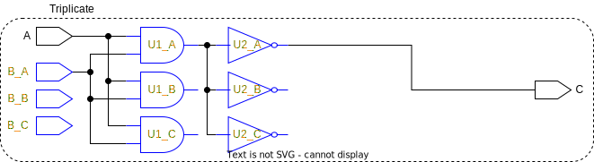
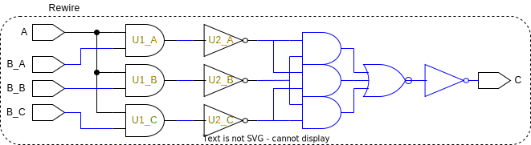

# Triple Modular Redundancy Tool - Developer Guide

The goal of this repository is to *ensure further development is approachable* for the TripleModularRedundancyTool developed in the second half of 2023.

## Context

This GitHub repository was created as documentation to subsidise a tool developed for triplication and majority voting of ASICs by leveraging industry EDAs, which in this case only covers Synopsys' Design Compiler NXT and Design Vision (GUI).

The TripleModularRedundancyTool was created as a part of a short-term internship at CERN during my 9th semester of my Master's degree in Electronic Systems.

## Message to Developers

The implementation leans heavily on **attributes** and has only been tested with [SystemVerilog attributes (see pp. 236--240)](https://spdocs.synopsys.com/dow_retrieve/qsc-u/dg/dcolh/U-2022.12-SP3/dcolh/pdf/svug.pdf). The way to interact with the implementation is through two attributes and a suffix:

* ```(*default_tmrt="value"*)```, where ```value``` is false/true
  * This should be applied to module declarations
  * This is the default value for whether or not ports, registers, and module instantiations should be triplicated. This will not override the ```tmrt``` attribute if already set
* ```(*tmrt="value"*)```, where ```value``` is false/true
  * This can be applied to ports, register (inferred by sequential logic), and module instantiations
  * This signals the implementation that an element should not follow the default w.r.t triplication, but rather the set value of the attribute
* "_Voted"-suffix
  * Can be applied to net declarations
  * Will create and insert 3 voters to create an intermediate vote of a net

As the TripleModularRedundancyTool currently stands, the design philosophy follows three steps (in order)

1. **Update**: Updating/propagating the values of the attribute mentioned above to other cells, ports, etc.
2. **Triplicate**: Creating 3 replicants of the elements with ```tmrt="true"```
3. **Rewire**: Drive all new cells appropriately, which includes voting when appropriate

To visualise the three steps the following figures were created, note that blue outline indicates a change of the circuitry. A piece of RTL design with two input ports (could also have been output pins from module instantiations or registers), two logic cells, and an output port (could also be input pins to module instantiations or registers). From the RTL the ```tmrt``` attribute has been set to true on input port B, marked with a orange text.

<picture>
  <source media="(prefers-color-scheme: dark)" srcset="figures/dark-mode/3-steps_0.drawio.svg">
  
</picture>

The **update step** applies the ```tmrt``` attribute set to true on all reachable logic cells from port B. This is visualised below with the orange text.

<picture>
  <source media="(prefers-color-scheme: dark)" srcset="figures/dark-mode/3-steps_1.drawio.svg">
  
</picture>

Every element with the ```tmrt``` attribute set to true a fetched and triplicated in the **triplicate step**. The replicants have their inputs driven by the same sources as the original cell, which can be seen below. Furthermore, this step implicitly handles all fanout situations, notice that port A has already been connected to all the correct pins.

<picture>
  <source media="(prefers-color-scheme: dark)" srcset="figures/dark-mode/3-steps_2.drawio.svg">
  
</picture>

The unconnected ports and output pins are handled in the **rewire step**. All the original elements, from which replicants have been generated, are inspected with a focus on their outputs. If the original cell is driving a triplicated element, the connections are redistributed to the replicants. B_A is driving three redundancy-generated AND-gates, and the connections are redistributed below. However, if the original cell is driving an element that is not triplicated, a voter should
be inserted and its output should be connected to the element. This is the case for the three
redundancy-generated NOT-gates and in the figure below, they are voted.

<picture>
  <source media="(prefers-color-scheme: dark)" srcset="figures/dark-mode/3-steps_3.drawio.svg">
  
</picture>

To see how the "_Voted"-suffix is handled and voted see **Example** in [```vote_nets```](rewire_scripts/vote_nets.md).

## General Comments

Before you continue the development of the tool, there are a few things, concepts, and interactions you should familiarize yourself with!

* [TCL 8.6 (Tool Command Language)](https://www.tcl.tk/man/tcl8.6/TclCmd/contents.html)
  * The language used to interact with the Synopsys tools
* TMR (Triple Modular Redundancy)
  * There are several TMR strategies worth investigating. A good start would be looking at the current [TMRG](https://tmrg.web.cern.ch/tmrg/) used by CERN at the time of writing as this documentation.
* Synopsys' Design Compiler NXT (Will require a SolvNet user)
  * [Design Compiler User Guide](https://spdocs.synopsys.com/dow_retrieve/qsc-t/dg/dcolh/T-2022.03/dcolh/Default.htm#dcug/pdf/dcug.pdf)
  * [Functional Safety for Implementation User Guide](https://spdocs.synopsys.com/dow_retrieve/qsc-t/dg/dcolh/T-2022.03/dcolh/Default.htm#fsiug/pdf/fsiug.pdf)
* Synopsys Design Vision (Will require a SolvNet user)
  * [Design Vision User Guide](https://spdocs.synopsys.com/dow_retrieve/qsc-t/dg/dcolh/T-2022.03/dcolh/Default.htm#dvug/pdf/dvug.pdf)
  * The 'man pages' through the GUI are also good to familiarize oneself with. They are faster, up to date, and do not include commands that you can't use (which is the case for SolvNet).

W.r.t **interactions** worth familiarization it is mostly between TCL and the Synopsys Tools. Try running the following commands line-by-line in the Design Compiler NXT CLI:

```tcl
dcnxt_shell> set cells [get_cells]
dcnxt_shell> puts $cells
```

You may see, that the output of ```puts $cells``` is something akin to ```_sel21```. This is due to Synopsys using [**Collections (see ch. 6)**](https://spdocs.synopsys.com/dow_retrieve/qsc-u/dg/dcolh/U-2022.12-SP3/dcolh/pdf/tclug.pdf), which I was unaware of during development. A way of dealing with this interaction is using their built-in function ```redirect``` to divert the command output to a variable:

```tcl
dcnxt_shell> redirect -variable cells {get_cells}
dcnxt_shell> puts $cells
```

This will now output the correct value! However, another interaction will be present, try looping over the ```$cells``` variable:

```tcl
dcnxt_shell> foreach cell $cells {puts $cell}
```

All cells are printed in the first loop! The variable is actually an element containing the list... To avoid these specific interactions, a *helper* function was created: [```get_synopsys_value```](/helper_functions/get_synopsys_value.md). This function is also capable of grabbing relevant information from other function, most notably ```duplicate_logic -report_only```.

And a few small advices:

* Most "return" functions (get_, all_, etc.) have a flag like ```-quiet``` or ```return_null_values```, which should always be applied! Otherwise, when using ```redirect``` the value of you variable will become the displayed message.
* Attributes cannot be applied to combinational logic from the RTL design, [SystemVerilog attributes (see pp. 236--240)](https://spdocs.synopsys.com/dow_retrieve/qsc-u/dg/dcolh/U-2022.12-SP3/dcolh/pdf/svug.pdf)

## Scripts and Functions

The main script can be found in [```main_script```](main_script.md) with a flowchart and the definition of the code.

The scripts and functions used in this tool have been separated in four categories; *update*, *triplicate*, *rewire*, and helper functions, where the first three correspond to the steps in the design philosophy presented above. Every function has been documented with focus on *purpose*, *usage*, *definition*, and an *example* with a figure if applicable.

* [Helper functions](helper_functions/)
  * [```get_default_tmrt```](helper_functions/get_default_tmrt.md)
  * [```get_driven_pins```](helper_functions/get_driven_pins.md)
  * [```get_driven_ports```](helper_functions/get_driven_ports.md)
  * [```get_driver_connection```](helper_functions/get_driver_connection.md)
  * [```get_hierarchy```](helper_functions/get_hierarchy.md)
  * [```get_replicants```](helper_functions/get_replicants.md)
  * [```get_synopsys_value```](helper_functions/get_synopsys_value.md)
  * [```get_top_design```](helper_functions/get_top_design.md)
  * [```is_cell```](helper_functions/is_cell.md)
  * [```is_port```](helper_functions/is_port.md)
  * [```lremove```](helper_functions/lremove.md)
* [Update scripts and functions](update_scripts/)
  * [```get_tmrt```](update_scripts/get_tmrt.md)
  * [```set_tmrt```](update_scripts/set_tmrt.md)
  * [```update_design_default_tmrt```](update_scripts/update_design_default_tmrt.md)
  * [```update_port_tmrt```](update_scripts/update_port_tmrt.md)
  * [```update_reg_tmrt```](update_scripts/update_reg_tmrt.md)
  * [```update_tmrt```](update_scripts/update_tmrt.md)
* [Triplicate scripts and functions](triplicate_scripts/)
  * [```triplicate_cell```](triplicate_scripts/triplicate_cell.md)
  * [```triplicate_cells```](triplicate_scripts/triplicate_cells.md)
  * [```triplicate_input_ports```](triplicate_scripts/triplicate_input_ports.md)
  * [```triplicate_instances```](triplicate_scripts/triplicate_instances.md)
  * [```triplicate_output_ports```](triplicate_scripts/triplicate_output_ports.md)
  * [```triplicate_port```](triplicate_scripts/triplicate_port.md)
* [Rewire scripts and functions](rewire_scripts/)
  * [```connect```](rewire_scripts/connect.md)
  * [```create_voter```](rewire_scripts/create_voter.md)
  * [```join_ports_in_busses```](rewire_scripts/join_ports_in_busses.md)
  * [```remove_ports_top```](rewire_scripts/remove_ports_top.md)
  * [```replace_cell```](rewire_scripts/replace_cell.md)
  * [```replace_port```](rewire_scripts/replace_port.md)
  * [```rewire_duped_cells```](rewire_scripts/rewire_duped_cells.md)
  * [```rewire_input_ports```](rewire_scripts/rewire_input_ports.md)
  * [```vote_nets```](rewire_scripts/vote_nets.md)

## Suggestions for improvements

Since this implementation was created over a relatively short period, some features were not implemented, and some of the functions are a bit underdeveloped/outdated (carried over from a previous version). These are some of the suggestions that could potentially improve the implementation:

* See if it is worth using [**collections (see ch. 6)**](https://spdocs.synopsys.com/dow_retrieve/qsc-u/dg/dcolh/U-2022.12-SP3/dcolh/pdf/tclug.pdf)
* Rewrite some functions
  * [```update_port_tmrt```](update_scripts/update_port_tmrt.md) and [```update_reg_tmrt```](update_scripts/update_reg_tmrt.md) still using ```redirect``` instead of [```get_synopsys_value```](helper_functions/get_synopsys_value.md). Furthermore, they go through the entire hierarchy instead of being called once per design (include them in the *loop*)
* Change naming scheme
  * To create three intermediate voters, nets are suffixed with "_Voted", however to gain continuity with the current TMRG the suffix should just be "Voted"
  * Replicants are suffixed with "_A", "_B", and "_C", but to gain contiunity with the current TMRG the suffixes should lose the underscore.
* Include the missing functionalities (see [TMRG](https://tmrg.web.cern.ch/tmrg/))
  * Slicing
  * Using the error signal
  * etc.
* Include a way to control how the ```tmrt``` attribute is propagated trough the combinatorial logic
  * Tie it to the default?
  * Create another attribute that can be applied to designs?
* Check the documentation for improved TMR built-in functions
  * At the time of writing functions associated with ```safety_register_rule```, ```safety_error_rule```, and ```safety_core_rule``` are the only TMR possibilities, but they were deemed too simple and incapable of performing certain TMR strategies

## Contact me

Feel free to contact me with questions about the implementation!

### Email

[albert.berg@hotmail.com](mailto:albert.berg@hotmail.com)

### Linkedin

[Albert Berg Hansen - Linkedin](https://www.linkedin.com/in/albert-berg-hansen-60745a25b)

### Whatsapp


