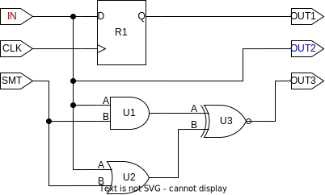

# ```get_driven_ports```

This function is a helper function!

## Purpose

This function fetches all **output ports** connected to driving pin/port. If the given input is not an input port or an output pin, an appropriate statement will be displayed, and nothing will be returned.

## Usage

This function is used mainly for the *rewire* routines, as the driven elements of triplicated elements must be redistributed or voted.

## Definition

```tcl
proc get_driven_ports { element } {
    ##################################################################################
    # looks forward from element and returns all connections, that 
    #       - are driven
    #       - are ports
    #
    # input:  pin/port
    # output: list of ports driven by the input pin/port
    ##################################################################################

    # empty list to hold all connections
    set connections ""

    # find connections based on whether the element is a port or a pin
    if {[is_port $element]} {   ;# element is a port

        # check if port is a driving connection
        set direction [get_synopsys_value "get_attribute [get_ports $element] pin_direction"]
        if {![string equal $direction "in"]} {
            puts "Port/pin $element is not a driving connection!"
            return
        }

        # retrieve all pins/ports connected to the same net as the element
        set net         [get_synopsys_value "all_connected [get_ports $element]"]
        if {[string length $net] < 1} {
            return ""
        }
        set connections [get_synopsys_value "all_connected [get_nets $net]"]

    } else {                    ;# element is a pin

        # check if pin is a driving connection
        set direction [get_synopsys_value "get_attribute [get_pins $element] pin_direction"]
        if {[string equal $direction "in"]} {
            puts "Port/pin $element is not a driving connection!"
            return
        }

        # retrieve all pins/ports connected to the same net as the element
        set net         [get_synopsys_value "all_connected [get_pins $element]"]
        if {[string length $net] < 1} {
            return ""
        }
        set connections [get_synopsys_value "all_connected [get_nets $net]"]
    }

    # remove element from list of connections
    set connections [lremove $connections $element]

    # remove all pins from list of connections
    foreach connection $connections {
        if {![is_port $connection]} {
            set connections [lremove $connections $connection]
        }
    }

    # return all ports (except for element)
    return $connections
}
```

This function will only work, if the following functions are sourced:

* ```is_port```
* ```get_synopsys_value```
* ```lremove```

## Example

Given the circuit below, if you use ```get_driven_ports``` on the IN port (marked in red), the returned value would be port OUT2 (marked in blue). Notice that the three pins connected to IN will not be returned, as they are not a ports!

<picture>
  <source media="(prefers-color-scheme: dark)" srcset="../figures/dark-mode/helper_functions/get_driven_ports.drawio.svg">
  
</picture>

When calling the function, it would look somewhat like:

```tcl
>> get_driven_ports IN
OUT2
```
