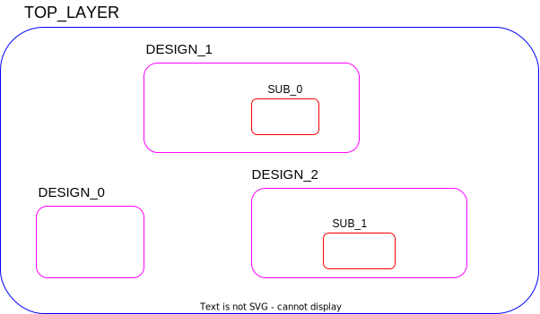

# ```get_hierarchy```

This is a helper function!

## Purpose

The purpose of this function is to make it easier to work from the bottom up (hierarchically) to ensure changes to designs will propagate appropriately, and voting/connections are not made prematurely. The function returns the hierarchy of the workspace as a list of lists; the first list is all module instantiations in the bottom-most layer, ..., and the last list is all the module instantiations in the top layer.

## Usage

If a module instantiation is defined within another module declaration, and its ports should be triplicated, it would be detrimental to vote and connect before the ports are triplicated.

Furthermore, when propagating the ```default_tmr``` attribute, this function is utilised to see parent-child relationships between module declarations.

## Definition

```tcl
proc get_hierarchy {} {
    #######################################################################
    # Looks through the current design to find all ''instances'' and the
    # hierarchy between them. 
    #
    # input:  nothing
    # output: a list of lists. all instances of a level bundled up with {}
    #         bottom-up
    #######################################################################

    array set hierarchy {}

    # find all cells in top design, that are hierarchical 
    set hier_cells [get_synopsys_value "get_cells -hierarchical -filter is_hierarchical==\"true\""]

    foreach cell $hier_cells {
        # find hierarchy based on number of '/' in full name
        set level [llength [split $cell "/"]]

        # add to array
        set hierarchy($cell) $level
    }

    # Create an empty list to store unique values
    set levels {}

    # Iterate over the array and collect unique values
    foreach key [array names hierarchy] {
        set value $hierarchy($key)
        
        # Check if the value is not already in the levels
        if {$value ni $levels} {
            lappend levels $value
        }
    }

    # ensure bottom-up and skip lowest level
    set levels [lsort -decreasing $levels]
    set levels [lrange $levels 0 end]
    
    set hierarchy_list ""
    foreach level $levels {
        # Specify the value you want to find keys for
        set target_value $level

        # Initialize a list to store keys associated with the target value
        set instances_associated_with_level {}

        # Iterate through the array and check values
        foreach key [array names hierarchy] {
            set value $hierarchy($key)
            
            if {$value eq $target_value} {
                lappend instances_associated_with_level $key
            }
        }

        # add to hierarchy list
        lappend hierarchy_list $instances_associated_with_level
    }

    return $hierarchy_list
}
```

This function will only work, if the following function is sourced:

* ```get_synopsys_value```

## Example

Given the hierarchy below:

<picture>
  <source media="(prefers-color-scheme: dark)" srcset="../figures/dark-mode/helper_functions/get_hierarchy.drawio.svg">
  
</picture>

If the function is called, the returned value would be:

```tcl
>> get_hierarchy
{DESIGN_1/SUB_0 DESIGN_2/SUB_1} {DESIGN_0 DESIGN_1 DESIGN_2}
```

The returned value is a list consisting of two lists, each encapsulated by brackets. The order of the list is the lowest hierachical layer first.
