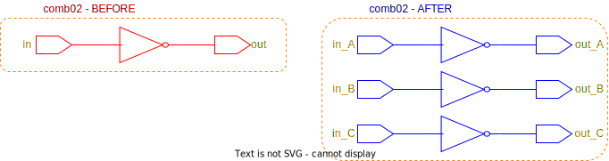

# TripleModularRedundancyTool User Guide

The purpose of this documentation is describe how an ASIC designer would approach the TripleModularRedundancyTool with triplication as the main goal. Below is a copy of the **Message to Developers** section in the [README](README.md), which should give a quick overview of the design philosophy behind the implementation.

---

The implementation leans heavily on **attributes** and has only been tested with [SystemVerilog attributes (see pp. 236--240)](https://spdocs.synopsys.com/dow_retrieve/qsc-u/dg/dcolh/U-2022.12-SP3/dcolh/pdf/svug.pdf). The way to interact with the implementation is through two attributes and a suffix:

* ```(*default_tmrt="value"*)```, where ```value``` is false/true
  * This should be applied to module declarations
  * This is the default value for whether or not ports, registers, and module instantiations should be triplicated. This will not override the ```tmrt``` attribute if already set
* ```(*tmrt="value"*)```, where ```value``` is false/true
  * This can be applied to ports, register (inferred by sequential logic), and module instantiations
  * This signals the implementation that an element should not follow the default w.r.t triplication, but rather the set value of the attribute
* "_Voted"-suffix
  * Can be applied to net declarations
  * Will create and insert 3 voters to create an intermediate vote of a net

As the TripleModularRedundancyTool currently stands, the design philosophy follows three steps (in order)

1. **Update**: Updating/propagating the values of the attribute mentioned above to other cells, ports, etc.
2. **Triplicate**: Creating 3 replicants of the elements with ```tmrt="true"```
3. **Rewire**: Drive all new cells appropriately, which includes voting when appropriate

To visualise the three steps the following figures were created, note that blue outline indicates a change of the circuitry. A piece of RTL design with two input ports (could also have been output pins from module instantiations or registers), two logic cells, and an output port (could also be input pins to module instantiations or registers). From the RTL the ```tmrt``` attribute has been set to true on input port B, marked with a orange text.

<picture>
  <source media="(prefers-color-scheme: dark)" srcset="figures/dark-mode/3-steps_0.drawio.svg">
  
</picture>

The **update step** applies the ```tmrt``` attribute set to true on all reachable logic cells from port B. This is visualised below with the orange text.

<picture>
  <source media="(prefers-color-scheme: dark)" srcset="figures/dark-mode/3-steps_1.drawio.svg">
  
</picture>

Every element with the ```tmrt``` attribute set to true is fetched and triplicated in the **triplicate step**. The replicants have their inputs driven by the same sources as the original cell, which can be seen below. Furthermore, this step implicitly handles all fanout situations, notice that port A has already been connected to all the correct pins.

<picture>
  <source media="(prefers-color-scheme: dark)" srcset="figures/dark-mode/3-steps_2.drawio.svg">
  
</picture>

The unconnected ports and output pins are handled in the **rewire step**. All the original elements, from which replicants have been generated, are inspected with a focus on their outputs. If the original cell is driving a triplicated element, the connections are redistributed to the replicants. B_A is driving three redundancy-generated AND-gates, and the connections are redistributed below. However, if the original cell is driving an element that is not triplicated, a voter should
be inserted and its output should be connected to the element. This is the case for the three
redundancy-generated NOT-gates and in the figure below, they are voted.

<picture>
  <source media="(prefers-color-scheme: dark)" srcset="figures/dark-mode/3-steps_3.drawio.svg">
  
</picture>

To see how the "_Voted"-suffix is handled and voted see **Example** in [```vote_nets```](rewire_scripts/vote_nets.md).

---

## Examples

The following examples are recreated from the currently utilised [TMRG](https://tmrg.web.cern.ch/tmrg/).

---

### Combinatorial Logic - Full Triplication

This example utilises the ```default_tmrt``` attribute set on the module declaration. This signals the implementation that all ports belonging to ```comb02``` should be triplicated. This will force the combinatorial logic between the ports to also be triplicated.

```sv
(*default_tmrt="true"*)
module comb02 (
    input  in,
    output out
);

    logic  combLogic;

    assign combLogic = ~in;
    assign out       = combLogic;

endmodule
```

The figure below shows the before and after of the triplication of ```comb02```. Red outline marks target, blue outline marks affected ports, cells, nets, etc. The orange dotted line indicates that the ```default_tmrt``` attribute has been set to true. The orange text indicates the elements, where the ```tmrt``` attribute has been set to true.

<picture>
  <source media="(prefers-color-scheme: dark)" srcset="figures/dark-mode/user_guide_examples/comb_logic/comb02_full_triplication.drawio.svg">
  
</picture>

---

### Combinatorial Logic - Logic and Output Triplication

This example utilises the ```default_tmrt``` attribute set on the module declaration and the ```tmrt``` attribute set on a **port**. This signals the implementation that all ports belonging to ```comb03``` except *in* should be triplicated. This will force the combinatorial logic between the ports to also be triplicated, and a **fanout** from *in*.

```sv
(*default_tmrt="true"*)
module comb03 (
    (*tmrt="false"*) input  in,
    output out
);

    logic  combLogic;

    assign combLogic = ~in;
    assign out       = combLogic;

endmodule
```

The figure below shows the before and after of the triplication of ```comb03```. Red outline marks target, blue outline marks affected ports, cells, nets, etc. The orange dotted line indicates that the ```default_tmrt``` attribute has been set to true. The pink text indicates that the ```tmrt``` attribute has been set to false, and the orange text indicates it has been set to true.

<picture>
  <source media="(prefers-color-scheme: dark)" srcset="figures\dark-mode\user_guide_examples\comb_logic\comb03_logic_and_output_triplication.drawio.svg">
  
</picture>

---

### Combinatorial Logic - Input and Logic Triplication

This example utilises the ```default_tmrt``` attribute set on the module declaration and the ```tmrt``` attribute set on a **port**. This signals the implementation that all ports belonging to ```comb04``` except *out* should be triplicated. This will force the combinatorial logic between the ports to also be triplicated, and the creation of a **majority voter** to *out*.

```sv
(*default_tmrt="true"*)
module comb04 (
    input  in,
    (*tmrt="false"*) output out
);

    logic  combLogic;

    assign combLogic = ~in;
    assign out       = combLogic;

endmodule
```

The figure below shows the before and after of the triplication of ```comb04```. Red outline marks target, blue outline marks affected ports, cells, nets, etc. The orange dotted line indicates that the ```default_tmrt``` attribute has been set to true. The pink text indicates that the ```tmrt``` attribute has been set to false, and the orange text indicates it has been set to true.

<picture>
  <source media="(prefers-color-scheme: dark)" srcset="figures\dark-mode\user_guide_examples\comb_logic\comb04_input_and_logic_triplication.drawio.svg">
  
</picture>

---

### Combinatorial Logic - Logic Triplication

This example utilises the ```default_tmrt``` attribute set on the module declaration and the ```tmrt``` attribute set on a **module instantiation**. This signals the implementation that everything except *comb_logic0* belonging to ```comb05``` should not be triplicated. This will force the creation of a **majority voter** to *out*.

The reason for the extra module declaration is that it is impossible to pass attributes directly to logic cells, and this is a workaround.

```sv
(*default_tmrt="false"*)
module comb05 (
    input  in,
    output out
);

    (*tmrt="true"*)
    combLogic combLogic0 (
        .in(in),
        .out(out)
    );

endmodule

module combLogic (
    input  in,
    output out
);

    assign out = ~in;

endmodule
```

The figure below shows the before and after of the triplication of ```comb05```. Red outline marks target, blue outline marks affected ports, cells, nets, etc. The pink dotted lines indicates that the ```default_tmrt``` attribute has been set to false on the module declaration associated with the contents. The pink text indicates that the ```tmrt``` attribute has been set to false, and the orange text indicates it has been set to true.

<picture>
  <source media="(prefers-color-scheme: dark)" srcset="figures\dark-mode\user_guide_examples\comb_logic\comb05_logic_triplication.drawio.svg">
  
</picture>

---

### Combinatorial Logic - Input and Output Triplication

This example utilises the ```default_tmrt``` attribute set on the module declaration and the ```tmrt``` attribute set on a **module instantiation**. This signals the implementation that everything except *comb_logic0* belonging to ```comb06``` should be triplicated. This will force the creation of a **majority voter** from *in*.

The reason for the extra module declaration is that it is impossible to pass attributes directly to logic cells, and this is a workaround.

```sv
(*default_tmrt="true"*)
module comb06 (
    input  in,
    output out
);

    (*tmrt="false"*)
    combLogic combLogic0 (
        .in(in),
        .out(out)
    );

endmodule

(*default_tmrt="false"*)
module combLogic (
    input  in,
    output out
);

    assign out = ~in;

endmodule
```

The figure below shows the before and after of the triplication of ```comb06```. Red outline marks target, blue outline marks affected ports, cells, nets, etc. The pink dotted lines indicates that the ```default_tmrt``` attribute has been set to false on the module declaration associated with the contents, whereas orange indicates it has been set to true. The pink text indicates that the ```tmrt``` attribute has been set to false, and the orange text indicates it has been set to true.

<picture>
  <source media="(prefers-color-scheme: dark)" srcset="figures\dark-mode\user_guide_examples\comb_logic\comb06_input_and_output_triplication.drawio.svg">
  
</picture>

---

### Voting Logic - Throughput Voting

This example utilises the ```default_tmrt``` attribute set on the module declaration and the suffix "_Voted" added to a net (indirectly). This signals the implementation that everything should be triplicated, and the net should be voted. This will force the creation of three **majority voter** from *in* to *out_Voted*.

The reason that the output port has been renamed is that the names of nets are unwieldy from the RTL design. Adding an intermediate ```logic net_Voted``` would've been removed when the RTL is read, and the net between *in* and *out* inherits the name from the output port.

```sv
(*default_tmrt="true"*)
module vote01(
    input  in,
    output out_Voted
);

    assign out_Voted = in;
    
endmodule
```

The figure below shows the before and after of the triplication of ```vote01```. Red outline marks target, blue outline marks affected ports, cells, nets, etc. The orange dotted lines indicates that the ```default_tmrt``` attribute has been set to true on the module declaration associated with the contents. The orange text indicates that the ```tmrt``` attribute has been set to true.

<picture>
  <source media="(prefers-color-scheme: dark)" srcset="figures\dark-mode\user_guide_examples\vote\vote01.drawio.svg">
  
</picture>

---

### Voting Logic - Vote Before and After Combinatorial Logic

This example utilises the ```default_tmrt``` attribute set on the module declaration and the suffix "_Voted" added to a net (indirectly). This signals the implementation that everything should be triplicated, and the nets should be voted. This will force the creation of three **majority voter** from *in* to *out_Voted*.

The reason that the input and output ports have been renamed is that the names of nets are unwieldy from the RTL design. Adding an intermediate ```logic net_Voted``` would've been removed when the RTL is read, and the net between *in* and *combLogic* inherits the name from the input port and between *combLogic* and *out* inherits the name from the output port.

```sv
(*default_tmrt="true"*)
module vote02(
    input  in_Voted,
    output out_Voted
);

    logic combLogic;

    assign combLogic = ~in_Voted;
    assign out_Voted = combLogic;

endmodule
```

The figure below shows the before and after of the triplication of ```vote02```. Red outline marks target, blue outline marks affected ports, cells, nets, etc. The orange dotted lines indicates that the ```default_tmrt``` attribute has been set to true on the module declaration associated with the contents. The orange text indicates that the ```tmrt``` attribute has been set to true.

<picture>
  <source media="(prefers-color-scheme: dark)" srcset="figures\dark-mode\user_guide_examples\vote\vote02.drawio.svg">
  
</picture>

---

### Finite State Machine - Triplication Without Voting

This example utilises the ```default_tmrt``` attribute set on the module declaration. This signals the implementation that everything should be triplicated.

```sv
(*default_tmrt="true"*)
module fsm01 (
    input  in,
    input  clk,
    output out
);

    logic state;
    logic state_next;

    assign out = state;

    always_ff @(posedge clk)
        state <= state_next;

    always_comb
        state_next = in ^ state;

endmodule
```

The figure below shows the before and after of the triplication of ```fsm01```. Red outline marks target, blue outline marks affected ports, cells, nets, etc. The orange dotted lines indicates that the ```default_tmrt``` attribute has been set to true on the module declaration associated with the contents or the ```tmrt``` attribute has been set to true on an inferred register. The orange text indicates that the ```tmrt``` attribute has been set to true.

<picture>
  <source media="(prefers-color-scheme: dark)" srcset="figures\dark-mode\user_guide_examples\fsm\fsm01_triplication_without_voting.drawio.svg">
  
</picture>

---

### Finite State Machine - Triplication With Voting

This example utilises the ```default_tmrt``` attribute set on the module declaration and the suffix "_Voted" attached to the ```logic``` input to the D flip-flop. This signals the implementation that everything should be triplicated and to create 3 voters just before the inferred registers.

```sv
(*default_tmrt="true"*)
module fsm02 (
    input  in,
    input  clk,
    output out
);

    logic state;
    logic state_next_Voted;

    assign out = state;

    always_ff @(posedge clk)
        state <= state_next_Voted;

    always_comb
        state_next_Voted = in ^ state;

endmodule
```

The figure below shows the before and after of the triplication of ```fsm02```. Red outline marks target, blue outline marks affected ports, cells, nets, etc. The orange dotted lines indicates that the ```default_tmrt``` attribute has been set to true on the module declaration associated with the contents or the ```tmrt``` attribute has been set to true on an inferred register. The orange text indicates that the ```tmrt``` attribute has been set to true.

<picture>
  <source media="(prefers-color-scheme: dark)" srcset="figures\dark-mode\user_guide_examples\fsm\fsm02_triplication_with_voting.drawio.svg">
  
</picture>

---

### Finite State Machine - Triplicating only the register

This example utilises the ```default_tmrt``` attribute set on two module declarations and the ```tmrt``` attribute set on a **sequential block**. This signals the implementation that only the registers should be triplicated and to create a voters just after the inferred registers.

The reason for the extra module declaration is that it is impossible to pass attributes directly to logic cells, and this is a workaround.

```sv
(*default_tmrt="false"*)
module fsm03 (
    input  in,
    input  clk,
    output out
);

    logic state;
    logic state_next;

    assign out = state;

    (*tmrt="true"*)
    always_ff @(posedge clk)
        state <= state_next;

    combLogic combLogic0 (
        .in(in),
        .state(state),
        .state_next(state_next)
    );

endmodule

module combLogic (
    input  in,
    input  state,
    output state_next
);

    assign state_next = in ^ state;

endmodule
```

The figure below shows the before and after of the triplication of ```fsm03```. Red outline marks target, blue outline marks affected ports, cells, nets, etc. The pink dotted lines indicates that the ```default_tmrt``` attribute has been set to false on the module declaration associated with the contents or the ```tmrt``` attribute has been set to false on an inferred register, whereas orange indicates it has been set to true. The pink text indicates that the ```tmrt``` attribute has been set to false.

<picture>
  <source media="(prefers-color-scheme: dark)" srcset="figures\dark-mode\user_guide_examples\fsm\fsm03_triplicating_only_the_register.drawio.svg">
  
</picture>

---

### Finite State Machine - Triplicating the Register and Clock Skew

This example utilises the ```default_tmrt``` attribute set on module declarations and the ```tmrt``` attribute set on a **sequential block** and a **port**. This signals the implementation that only the registers and the *clk* port should be triplicated and to create a voters just after the inferred registers.

The reason for the extra module declaration is that it is impossible to pass attributes directly to logic cells, and this is a workaround.

```sv
(*default_tmrt="false"*)
module fsm04 (
    input  in,
    (*tmrt="true"*) input  clk,
    output out
);

    logic state;
    logic state_next;

    assign out = state;

    (*tmrt="true"*)
    always_ff @(posedge clk)
        state <= state_next;

    combLogic combLogic0 (
        .in(in),
        .state(state),
        .state_next(state_next)
    );

endmodule

module combLogic (
    input  in,
    input  state,
    output state_next
);

    assign state_next = in ^ state;

endmodule
```

The figure below shows the before and after of the triplication of ```fsm04```. Red outline marks target, blue outline marks affected ports, cells, nets, etc. The pink dotted lines indicates that the ```default_tmrt``` attribute has been set to false on the module declaration associated with the contents or the ```tmrt``` attribute has been set to false on an inferred register, whereas orange indicates it has been set to true. The pink text indicates that the ```tmrt``` attribute has been set to false, and the orange text indicates it has been set to true.

<picture>
  <source media="(prefers-color-scheme: dark)" srcset="figures\dark-mode\user_guide_examples\fsm\fsm04_triplicating_the_register_and_clock_skew.drawio.svg">
  
</picture>

---

### Module Instantiations - Triplicating a Fixed Macrocell

This example utilises the ```default_tmrt``` attribute set on the module declarations. This signals the implementation that all ports belonging to ```inst01``` and the module instantiation ```logic01``` should be triplicated.

```sv
(*default_tmrt="false"*)
module mlogic(
    input  I,
    output ZN
);

    assign ZN = ~I;
    
endmodule

(*default_tmrt="true"*)
module inst01 (
    input  in,
    output out
);

    (*tmrt="true"*)
    mlogic logic01 (
        .I(in),
        .ZN(out)
    );

endmodule
```

The figure below shows the before and after of the triplication of ```inst01```. Red outline marks target, blue outline marks affected ports, cells, nets, etc. The orange dotted lines indicates that the ```default_tmrt``` attribute has been set to true on the module declaration associated with the contents, and pink indicates false. The orange text indicates that the ```tmrt``` attribute has been set to true.

<picture>
  <source media="(prefers-color-scheme: dark)" srcset="figures\dark-mode\user_guide_examples\module_instantiations\inst01_triplicating_fixed_macrocell.drawio.svg">
  
</picture>

---

### Module Instantations - Non-triplicating a Fixed Macrocell

This example utilises the ```default_tmrt``` attribute set on the module declarations. This signals the implementation that everything except the module instantiation ```logic01``` should be triplicated. This forces the creation of a majority voter and fanout.

```sv
(*default_tmrt="false"*)
module mlogic(
    input  I,
    output ZN
);

    assign ZN = ~I;
    
endmodule

(*default_tmrt="true"*)
module inst02 (
    input  in,
    output out
);

    (*tmrt="false"*)
    mlogic logic01 (
        .I(in),
        .ZN(out)
    );

endmodule
```

The figure below shows the before and after of the triplication of ```inst02```. Red outline marks target, blue outline marks affected ports, cells, nets, etc. The orange dotted lines indicates that the ```default_tmrt``` attribute has been set to true on the module declaration associated with the contents, and pink indicates false. The orange text indicates that the ```tmrt``` attribute has been set to true, and pink indicates false.

<picture>
  <source media="(prefers-color-scheme: dark)" srcset="figures\dark-mode\user_guide_examples\module_instantiations\inst02_non_triplicating_fixed_macrocell.drawio.svg">
  
</picture>

---

### Module Instantations - Triplicating a User's Macrocell

This example utilises the ```default_tmrt``` attribute set on the module declarations. This signals the implementation that everything except the module instantiation ```logic01``` should be triplicated. This forces the creation of a majority voter and fanout.

```sv
(*default_tmrt="true"*)
module mlogic(
    input  I,
    output ZN
);

    assign ZN = ~I;
    
endmodule

(*default_tmrt="true"*)
module inst01 (
    input  in,
    output out
);

    (*tmrt="false"*)
    mlogic logic01 (
        .I(in),
        .ZN(out)
    );

endmodule
```

The figure below shows the before and after of the triplication of ```inst02```. Red outline marks target, blue outline marks affected ports, cells, nets, etc. The orange dotted lines indicates that the ```default_tmrt``` attribute has been set to true on the module declaration associated with the contents. The orange text indicates that the ```tmrt``` attribute has been set to true, and pink indicates false.

<picture>
  <source media="(prefers-color-scheme: dark)" srcset="figures\dark-mode\user_guide_examples\module_instantiations\inst03_triplicating_user_macrocell.drawio.svg">
  
</picture>
