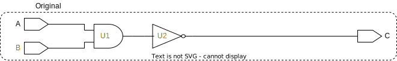

# TripleModularRedundancyTool User Guide

The purpose of this documentation is describe how an ASIC designer would approach the TripleModularRedundancyTool with triplication as the main goal. Below is a copy of the **Message to Developers** section in the [README](README.md), which should give a quick overview 

---

The implementation leans heavily on **attributes** and has only been tested with [SystemVerilog attributes (see pp. 236--240)](https://spdocs.synopsys.com/dow_retrieve/qsc-u/dg/dcolh/U-2022.12-SP3/dcolh/pdf/svug.pdf). The way to interact with the implementation is through two attributes and a suffix:

* ```(*default_tmrt="value"*)```, where ```value``` is false/true
  * This should be applied to module declarations
  * This is the default value for whether or not ports, registers, and module instantiations should be triplicated. This will not override the ```tmrt``` attribute if already set
* ```(*tmrt="value"*)```, where ```value``` is false/true
  * This can be applied to ports, register (inferred by sequential logic), and module instantiations
  * This signals the implementation that an element should not follow the default w.r.t triplication, but rather the set value of the attribute
* "_Voted"-suffix
  * Can be applied to net declarations
  * Will create and insert 3 voters to create an intermediate vote of a net

As the TripleModularRedundancyTool currently stands, the design philosophy follows three steps (in order)

1. **Update**: Updating/propagating the values of the attribute mentioned above to other cells, ports, etc.
2. **Triplicate**: Creating 3 replicants of the elements with ```tmrt="true"```
3. **Rewire**: Drive all new cells appropriately, which includes voting when appropriate

To visualise the three steps the following figures were created, note that blue outline indicates a change of the circuitry. A piece of RTL design with two input ports (could also have been output pins from module instantiations or registers), two logic cells, and an output port (could also be input pins to module instantiations or registers). From the RTL the ```tmrt``` attribute has been set to true on input port B, marked with a orange text.

<picture>
  <source media="(prefers-color-scheme: dark)" srcset="figures/dark-mode/3-steps_0.drawio.svg">
  
</picture>

The **update step** applies the ```tmrt``` attribute set to true on all reachable logic cells from port B. This is visualised below with the orange text.

<picture>
  <source media="(prefers-color-scheme: dark)" srcset="figures/dark-mode/3-steps_1.drawio.svg">
  
</picture>

Every element with the ```tmrt``` attribute set to true a fetched and triplicated in the **triplicate step**. The replicants have their inputs driven by the same sources as the original cell, which can be seen below. Furthermore, this step implicitly handles all fanout situations, notice that port A has already been connected to all the correct pins.

<picture>
  <source media="(prefers-color-scheme: dark)" srcset="figures/dark-mode/3-steps_2.drawio.svg">
  
</picture>

The unconnected ports and output pins are handled in the **rewire step**. All the original elements, from which replicants have been generated, are inspected with a focus on their outputs. If the original cell is driving a triplicated element, the connections are redistributed to the replicants. B_A is driving three redundancy-generated AND-gates, and the connections are redistributed below. However, if the original cell is driving an element that is not triplicated, a voter should
be inserted and its output should be connected to the element. This is the case for the three
redundancy-generated NOT-gates and in the figure below, they are voted.

<picture>
  <source media="(prefers-color-scheme: dark)" srcset="figures/dark-mode/3-steps_3.drawio.svg">
  
</picture>

To see how the "_Voted"-suffix is handled and voted see **Example** in [```vote_nets```](rewire_scripts/vote_nets.md).

---

## Examples

The following examples are recreated from the current [TMRG](https://tmrg.web.cern.ch/tmrg/).

---

### Combinatorial Logic - Full Triplication

```sv
(*default_tmrt="true"*)
module comb02 (
    input  in,
    output out
);

    logic  combLogic;

    assign combLogic = ~in;
    assign out       = combLogic;

endmodule
```

<picture>
  <source media="(prefers-color-scheme: dark)" srcset="figures/dark-mode/user_guide_examples/comb_logic/comb02_full_triplication.drawio.svg">
  
</picture>

---

### Combinatorial Logic - Logic and Output Triplication

```sv
(*default_tmrt="true"*)
module comb03 (
    (*tmrt="false"*) input  in,
    output out
);

    logic  combLogic;

    assign combLogic = ~in;
    assign out       = combLogic;

endmodule
```

<picture>
  <source media="(prefers-color-scheme: dark)" srcset="figures\dark-mode\user_guide_examples\comb_logic\comb03_logic_and_output_triplication.drawio.svg">
  
</picture>

---

### Combinatorial Logic - Input and Logic Triplication

```sv
(*default_tmrt="true"*)
module comb04 (
    input  in,
    (*tmrt="false"*) output out
);

    logic  combLogic;

    assign combLogic = ~in;
    assign out       = combLogic;

endmodule
```

<picture>
  <source media="(prefers-color-scheme: dark)" srcset="figures\dark-mode\user_guide_examples\comb_logic\comb04_input_and_logic_triplication.drawio.svg">
  
</picture>

---

### Combinatorial Logic - Logic Triplication

```sv
(*default_tmrt="false"*)
module comb02 (
    input  in,
    output out
);

    (*tmrt="true"*)
    combLogic combLogic0 (
        .in(in),
        .out(out)
    );

endmodule

module combLogic (
    input  in,
    output out
);

    assign out = ~in;

endmodule
```

<picture>
  <source media="(prefers-color-scheme: dark)" srcset="figures\dark-mode\user_guide_examples\comb_logic\comb05_logic_triplication.drawio.svg">
  
</picture>

---

### Combinatorial Logic - Input and Output Triplication

```sv
(*default_tmrt="true"*)
module comb06 (
    input  in,
    output out
);

    (*tmrt="false"*)
    combLogic combLogic0 (
        .in(in),
        .out(out)
    );

endmodule

(*default_tmrt="false"*)
module combLogic (
    input  in,
    output out
);

    assign out = ~in;

endmodule
```

<picture>
  <source media="(prefers-color-scheme: dark)" srcset="figures\dark-mode\user_guide_examples\comb_logic\comb06_input_and_output_triplication.drawio.svg">
  
</picture>

---

### Voting Logic - Throughput Voting

```sv
(*default_tmrt="true"*)
module vote01(
    input  in,
    output out_Voted
);

    assign out_Voted = in;
    
endmodule
```

<picture>
  <source media="(prefers-color-scheme: dark)" srcset="figures\dark-mode\user_guide_examples\vote\vote01.drawio.svg">
  
</picture>

---

### Voting Logic - Vote Before and After Combinatorial Logic

```sv
(*default_tmrt="true"*)
module vote02(
    input  in_Voted,
    output out_Voted
);

    logic combLogic;

    assign combLogic = ~in_Voted;
    assign out_Voted = combLogic;

endmodule
```

<picture>
  <source media="(prefers-color-scheme: dark)" srcset="figures\dark-mode\user_guide_examples\vote\vote02.drawio.svg">
  
</picture>

---

### Finite State Machine - Triplication Without Voting

```sv
(*default_tmrt="true"*)
module fsm01 (
    input  in,
    input  clk,
    output out
);

    logic state;
    logic state_next;

    assign out = state;

    always_ff @(posedge clk)
        state <= state_next;

    always_comb
        state_next = in ^ state;

endmodule
```

<picture>
  <source media="(prefers-color-scheme: dark)" srcset="figures\dark-mode\user_guide_examples\fsm\fsm01_triplication_without_voting.drawio.svg">
  
</picture>

---

### Finite State Machine - Triplication With Voting

Not entirely possible (inserts 2 voters instead of one)... Could be fixed with a bit of tinkering. In this case it might be better to use ```create_safety_register_rule -type triple_mode```.

```sv
(*default_tmrt="false"*)
module fsm03 (
    input  in,
    input  clk,
    output out
);

    logic state;
    logic state_next;

    assign out = state;

    (*tmrt="true"*)
    always_ff @(posedge clk)
        state <= state_next;

    combLogic combLogic0 (
        .in(in),
        .state(state),
        .state_next(state_next)
    );

endmodule

module combLogic (
    input  in,
    input  state,
    output state_next
);

    assign state_next = in ^ state;

endmodule
```

<picture>
  <source media="(prefers-color-scheme: dark)" srcset="figures\dark-mode\user_guide_examples\fsm\fsm02_triplication_with_voting.drawio.svg">
  
</picture>

---

### Finite State Machine - Triplicating only the register

```sv

```

<picture>
  <source media="(prefers-color-scheme: dark)" srcset="figures\dark-mode\user_guide_examples\fsm\fsm03_triplicating_only_the_register.drawio.svg">
  
</picture>

---

### Finite State Machine - Triplicating the Register and Clock Skew

```sv

```

<picture>
  <source media="(prefers-color-scheme: dark)" srcset="figures\dark-mode\user_guide_examples\fsm\fsm04_triplicating_the_register_and_clock_skew.drawio.svg">
  
</picture>

---

### Module Instantiations - Triplicating a Fixed Macrocell

```sv
(*default_tmrt="false"*)
module mlogic(
    input  I,
    output ZN
);

    assign ZN = ~I;
    
endmodule

(*default_tmrt="true"*)
module inst01 (
    input  in,
    output out
);

    (*tmrt="true"*)
    mlogic logic01 (
        .I(in),
        .ZN(out)
    );

endmodule
```

<picture>
  <source media="(prefers-color-scheme: dark)" srcset="figures\dark-mode\user_guide_examples\module_instantiations\inst01_triplicating_fixed_macrocell.drawio.svg">
  
</picture>

---

### Module Instantations - Non-triplicating a Fixed Macrocell

```sv
(*default_tmrt="false"*)
module mlogic(
    input  I,
    output ZN
);

    assign ZN = ~I;
    
endmodule

(*default_tmrt="true"*)
module inst01 (
    input  in,
    output out
);

    (*tmrt="false"*)
    mlogic logic01 (
        .I(in),
        .ZN(out)
    );

endmodule
```

<picture>
  <source media="(prefers-color-scheme: dark)" srcset="figures\dark-mode\user_guide_examples\module_instantiations\inst02_non_triplicating_fixed_macrocell.drawio.svg">
  
</picture>

---

### Module Instantations - Triplicating a User's Macrocell

```sv
(*default_tmrt="true"*)
module mlogic(
    input  I,
    output ZN
);

    assign ZN = ~I;
    
endmodule

(*default_tmrt="true"*)
module inst01 (
    input  in,
    output out
);

    (*tmrt="false"*)
    mlogic logic01 (
        .I(in),
        .ZN(out)
    );

endmodule
```

<picture>
  <source media="(prefers-color-scheme: dark)" srcset="figures\dark-mode\user_guide_examples\module_instantiations\inst03_triplicating_user_macrocell.drawio.svg">
  
</picture>
