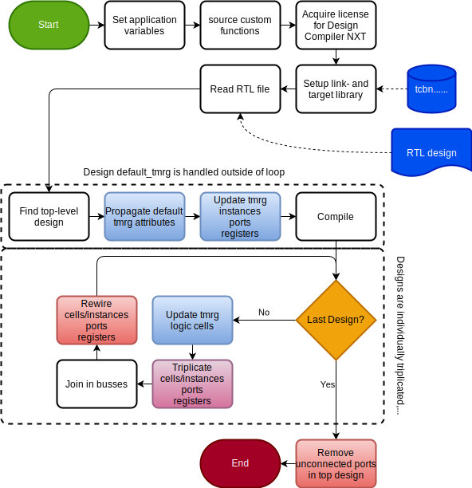

# ```synopsys_startup_attributes```

This is the main script. It is called through Design Compiler NXT's CLI:

```tcl
>> dcnxt_shell -f synopsys_scripts/synopsys_startup.tcl
```

Or more appropriately using the Makefile command:

```bash
>> make syn_startup_attributes
```

## Purpose

The purpose of this script is to facilitate and execute the triplication process. Application variable are set, libraries are sourced, licenses are aquired, RTL is read, and triplication is performed.

## Usage/flow

This is the main script, wherefrom all other scripts and functions are directly or indirectly called. This means it is called only once! The flowchart is shown in the figure below.

<picture>
  <source media="(prefers-color-scheme: dark)" srcset="figures/dark-mode/flowchart_v3.drawio.svg">
  
</picture>

## Definition

```tcl
# Set application variables
set_app_var hdlin_sv_enable_rtl_attributes true
set_app_var collection_result_display_limit 100000  ;# important! ensures searching functions 
                                                     # returns more results than the first 100
set_app_var compile_ultra_ungroup_small_hierarchies false

# source custom functions
source /projects/TSMC28/devel28/V09eval/workAreas/alhansen/synopsys_TMR_test/libs/tmrt_lib.tcl

# Acquire license
get_license Design-Compiler-NXT

# Setup libs
set lib /vlsicad/micsoft/TSMC28/HPCplusRF/HEP_DesignKit_TSMC28_HPCplusRF_v1.1/TSMCHOME/digital/Front_End/timing_power_noise/NLDM/tcbn28hpcplusbwp7t30p140_180a/tcbn28hpcplusbwp7t30p140ffg0p88v0c.db
set link_library "* $lib"
set target_library $lib


# Read file
# read_file -format sverilog            ../../example_timer/timer.sv
read_file -format sverilog ../../examples_for_documentation/vote02.sv

# Find top level design
set top_design [get_top_design]
current_design $top_design


# Find default tmrt
redirect -variable tmrt {get_attribute $top_design default_tmrt}
set top_default [join $tmrt]


# update deafult tmrt for designs, and update tmrt for ports and registers (non-overriding)
update_design_default_tmrt

update_reg_tmrt  $top_design
update_port_tmrt $top_design

compile_ultra -no_autoungroup

if {0} {

#--------- Triplication process --------#
set hierarchy [get_hierarchy]
set designs ""
foreach level $hierarchy {
    foreach module_instantiation $level {
        set designs [join [list $designs [get_attribute $module_instantiation ref_name]]]
    }
}
set designs [join [list $designs $top_design]]

foreach design $designs {
    puts "//////////////////////////////////////////"
    puts "---current_design $design---"
    puts "//////////////////////////////////////////"
    current_design $design
    puts "//////////////////////////////////////////"
    puts "---update_tmrt $top_default---"
    puts "//////////////////////////////////////////"
    update_tmrt $top_default
    puts "//////////////////////////////////////////"
    puts "---triplicate_cells---"
    puts "//////////////////////////////////////////"
    triplicate_cells
    puts "//////////////////////////////////////////"
    puts "---triplicate_input_ports---"
    puts "//////////////////////////////////////////"
    triplicate_input_ports
    puts "//////////////////////////////////////////"
    puts "---triplicate_output_ports---"
    puts "//////////////////////////////////////////"
    triplicate_output_ports
    puts "//////////////////////////////////////////"
    puts "---triplicate_instances---"
    puts "//////////////////////////////////////////"
    triplicate_instances
    puts "//////////////////////////////////////////"
    puts "---join_ports_in_busses---"
    puts "//////////////////////////////////////////"
    join_ports_in_busses
    puts "//////////////////////////////////////////"
    puts "---rewire_duped_cells---"
    puts "//////////////////////////////////////////"
    rewire_duped_cells
    puts "//////////////////////////////////////////"
    puts "---rewire_input_ports---"
    puts "//////////////////////////////////////////"
    rewire_input_ports
    puts "//////////////////////////////////////////"
    puts "---vote_nets---"
    puts "//////////////////////////////////////////"
    vote_nets

    set designs_bla [get_synopsys_value "get_designs"]
    puts $designs_bla
}


current_design $top_design
remove_ports_top

# Open gui
gui_start 

# save netlist
# analyze   -format sverilog -work work ../../timer/timer.sv 
change_names -rules verilog
write_file -format verilog -hierarchy -output ../../timer/timer_netlist.v 
exit

} else {
    gui_start
}
```

By out-commenting ```gui_start``` and in-commenting the last four lines of code, the netlist will be produced immediately
