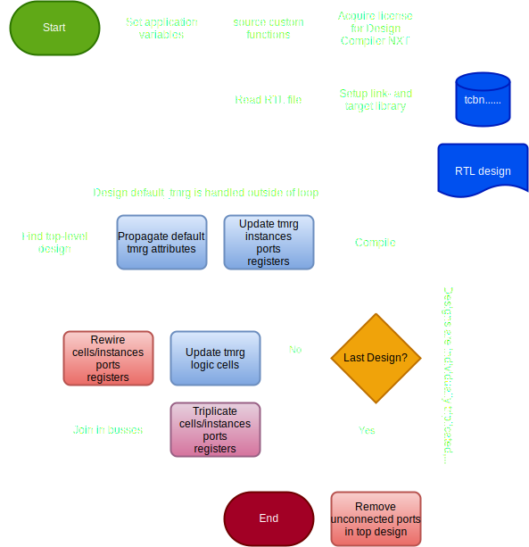

# ```synopsys_startup_attributes```

This is the main script. It is called through Design Compiler NXT's CLI:

```tcl
>> dcnxt_shell -f synopsys_scripts/synopsys_startup.tcl
```

Or more appropriately using the Makefile command:

```bash
>> make syn_startup_attributes
```

## Purpose

The purpose of this script is to facilitate and execute the triplication process. Application variable are set, libraries are sourced, licenses are aquired, RTL is read, and triplication is performed.

## Usage/flow

This is the main script, wherefrom all other scripts and functions are directly or indeirectly called. This means it is called only once! The flowchart is shown in the figure below.

<picture>
  <source media="(prefers-color-scheme: dark)" srcset="figures/dark-mode/flowchart_v3.drawio.svg">
  
</picture>

## Definition

```tcl
# Enable verilog attributes
set_app_var hdlin_sv_enable_rtl_attributes true
set_app_var collection_result_display_limit 100000  ;# important! ensures searching functions 
                                                     # returns more results than the first 100
set_app_var compile_ultra_ungroup_small_hierarchies false

# source custom functions
source /projects/TSMC28/devel28/V09eval/workAreas/alhansen/synopsys_TMR_test/libs/tmrg_lib.tcl

# Acquire license
get_license Design-Compiler-NXT

# Setup libs
set lib /vlsicad/micsoft/TSMC28/HPCplusRF/HEP_DesignKit_TSMC28_HPCplusRF_v1.1/TSMCHOME/digital/Front_End/timing_power_noise/NLDM/tcbn28hpcplusbwp7t30p140_180a/tcbn28hpcplusbwp7t30p140ffg0p88v0c.db
set link_library "* $lib"
set target_library $lib

# Read file
read_file -format sverilog            ../../example_timer/timer.sv

# Find top level design
set top_design [get_top_design]
current_design $top_design

# Find default tmrg
redirect -variable tmrg {get_attribute $top_design default_tmrg}
set top_default [join $tmrg]


# update deafult tmrg for designs, and update tmrg for ports and registers (non-overriding)
update_design_default_tmrg

update_reg_tmrg  $top_design
update_port_tmrg $top_design

compile_ultra -no_autoungroup

#--------- Triplication process --------#
set designs [get_synopsys_value "get_designs"]

foreach design $designs {
    current_design $design
    update_tmrg $top_default
    triplicate_cells
    triplicate_input_ports
    triplicate_output_ports
    triplicate_instances
    join_ports_in_busses
    rewire_duped_cells
    rewire_input_ports
    vote_nets
}
current_design $top_design
remove_ports_top

# Open gui
gui_start 

# save netlist
# analyze   -format sverilog -work work ../../timer/timer.sv 
# change_names -rules verilog
# write_file -format verilog -hierarchy -output ../../timer/timer_netlist.v 
# exit
```

By out-commenting ```gui_start``` and in-commenting the last four lines of code, the netlist will be produced immediately