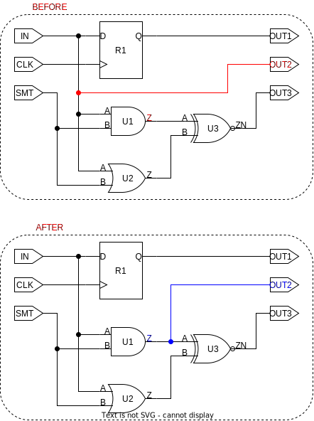

# ```connect```

This is a *rewire* script!

## Purpose

The purpose of this script is to make the process of connecting two pins/ports easier. There already exist multiple built-in functions to draw connection, however they come with caveats:

* ```connect_pin```
* ```connect_net```

If neither of the pins/ports are connected to nets, the ```connect_pin``` will work flawlessly, but if either of the pins/ports is connected to a net ```connect_pin``` will fail, and ```connect_net``` should be used instead. If both connections are already connected to a net, it is necessary to disconnect on or both from the nets connected nets. Furtermore, the issue of ports and their respective nets having identical names may cause unintended connections, unless the developer is familiar with the usage of ```get_ports```, ```get_nets```, etc.

## Usage

If the driving connection is already driving pins/ports, these will still be driven, but if the driven connection(s) is connected to other pins/ports through a net, this connection will be severed!

It is used whenever a connection is to be drawn, which is the case for most of the *rewire* scripts. It is also recommended to use this function to retain consistency in how connections are drawn. As of the current implementation, the name of the net between the driver pin/port and the driven pins/ports will be changed, unless the name is suffixed with "_Voted", which will be treated during the ```vote_nets``` rewire script.

## Definition

```tcl
proc connect {driver_pin driven_pins} {
    ########################################################################################
    # connects a set consisting of a driver pin (port), and
    # pins/ports that should be driven by the driver
    #
    # input:  A pin/port to drive. A list of pins/ports to be driven
    # output: nothing 
    ########################################################################################
    # puts "Connect has been called with the following input\n\t$driver_pin\n\t$driven_pins"
    
    set driver_pin_net ""
    set driven_pin_net ""
    set net            ""

    # find net connected to driver
    if {[is_port $driver_pin]} {
        set driver_pin_net [get_synopsys_value "all_connected [get_ports -quiet $driver_pin]"]
    } else {
        set driver_pin_net [get_synopsys_value "all_connected [get_pins  -quiet $driver_pin]"]
    }
    set net $driver_pin_net

    # look through nets connected to driven pins, if suffix '_Voted' use as net
    foreach pin $driven_pins {
        if {[is_port $pin]} {
            set driven_pin_net [get_synopsys_value "all_connected [get_ports -quiet $pin]"]
        } else {
            set driven_pin_net [get_synopsys_value "all_connected [get_pins  -quiet $pin]"]
        }

        set driven_pin_net [regexp -all -inline {\S+_Voted\S*} $driven_pin_net]
        if { [llength $driven_pin_net] > 0} {
            # override net name
            set net $driven_pin_net
            break
        }
    }

    #  if no net was present, create a new one
    if {[string length $net] == 0} {
        set net [split $driver_pin "/"]
        set net [join $net "_"]
        set net [join [list $net "net"] "_"]
        create_net $net
    } 

    # connect driver pin to net
    if {[is_port $driver_pin]} {
        set old_net [get_synopsys_value "all_connected [get_ports -quiet $driver_pin]"]
        if {[string length $old_net] > 0} {
            disconnect_net [get_nets $old_net] [get_ports $driver_pin]
        }
        connect_net [get_nets $net] [get_ports $driver_pin]
    } else {
        set old_net [get_synopsys_value "all_connected [get_pins  -quiet $driver_pin]"]
        if {[string length $old_net] > 0} {
            disconnect_net [get_nets $old_net] [get_pins $driver_pin]
        }
        connect_net [get_nets $net] [get_pins $driver_pin]
    }

    # connect driven pins to net
    foreach pin $driven_pins {
        if {[is_port $pin]} {
            set old_net [get_synopsys_value "all_connected [get_ports -quiet $pin]"]
            if {[string length $old_net] > 0} {
                disconnect_net [get_nets $old_net] [get_ports $pin]
            }
            connect_net    [get_nets $net]     [get_ports $pin]
        } else {
            set old_net [get_synopsys_value "all_connected [get_pins  -quiet $pin]"]
            if {[string length $old_net] > 0} {
                disconnect_net [get_nets $old_net] [get_pins $pin]
            }
            connect_net    [get_nets $net]     [get_pins $pin]
        }
    }
}
```

This function will only work, if the following function is sourced:

* ```get_synopsys_value```

## Example

The figure below depicts before (marked in blue) and after (marked in red) of the following function call:

```tcl
>> connect U1/Z OUT2
```

<picture>
  <source media="(prefers-color-scheme: dark)" srcset="../figures/dark-mode/rewire_scripts/connect.drawio.svg">
  
</picture>
