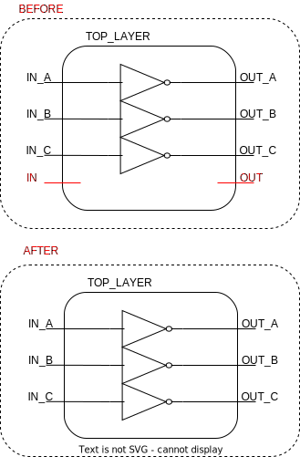

# ```remove_ports_top```

This is a *rewire* script!

## Purpose

When triplicating ports the name of the port should be changed. If a port ```clk``` is triplicated, it should be replaced with ```clk_A```, ```clk_B```, and ```clk_C```. By default ports cannot be renamed, and thus the port must be *replaced*. This is done with the ```replace_port``` function, however, if a port of a module instantiation within a hierarchy is removed from its design, DC NXT will not recognise the design. The ```replace_port``` will therefore not remove the original cell, but just let it be left disconnected to-be-removed from a layer above. This procedure will work for any layer except the top layer, and the disconnected ports in the top layer is removed by calling this script instead.

## Usage

After all *update*, *triplicate*, and *rewire* routines have been executed, this function is called to clean up disconnected ports in the top layer only.

## Definition

```tcl
proc remove_ports_top {} {
    ############################################################
    # Clean up of top layer disconnected ports, by removing
    # original port, that has been triplicated and should be
    # replaced with a port of an appropriate name
    #
    # input:  none
    # output: none
    ############################################################

    # retrieve all ports
    set ports_in  [get_synopsys_value "all_inputs"]
    set ports_out [get_synopsys_value "all_outputs"]
    set ports     [join [list $ports_in $ports_out]]

    # remove all triplicated ports with correct suffixes from the list
    set ports     [lsearch -all -inline -not -regexp $ports {[^ ]+_[ABC](?=\s|$)}]

    # remove 'original' ports
    foreach port $ports {
        if {[get_tmrt $port] == true} {
            remove_port $port
        }
    }
}
```

This function will only work, if the following function is sourced:

* ```get_synopsys_value```

## Example

The figure below is a design with 1 input and 1 output port originally, however they have both been triplicated, leaving the original ports disconnected. The disconnected ports are removed by calling the script.

<picture>
  <source media="(prefers-color-scheme: dark)" srcset="../figures/dark-mode/rewire_scripts/remove_ports_top.drawio.svg">
  
</picture>