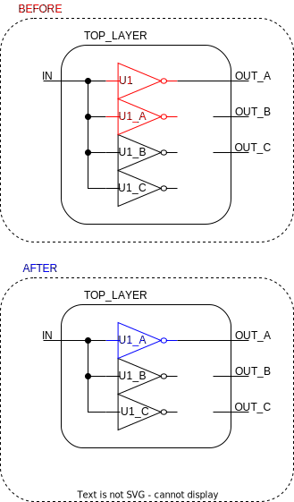

# ```replace_cell```

This is a *rewire* function!

## Purpose

The purpose of this function is to be able to indirectly rename cells, since it is not currently possible to rename cells in DC NXT.

## Usage

After triplicating a cell (creating three extra identical cells), the original cell has to be removed and *replaced* by one of the replicants, which is the only usage of this function. The function also ensures the cells are identical by comparing their ```ref_name```s, which is name of the mapped cell.

## Definition

```tcl
proc replace_cell { original replacement {force_replace "false"}} {
    ########################################################################################
    # replaces a cell with a replicant of the same design (connecting pins)
    # this function is used to rename cells, since seemingly this cannot be
    # done otherwise
    #
    # input:  two cells of the same design
    # output: nothing
    ########################################################################################
    set pins_original_in     [get_synopsys_value "get_pins -of_object $original -filter pin_direction==in"]
    set pins_replacement_in  [get_synopsys_value "get_pins -of_object $replacement -filter pin_direction==in"]
    set pins_original_out    [get_synopsys_value "get_pins -of_object $original -filter pin_direction==out"]
    set pins_replacement_out [get_synopsys_value "get_pins -of_object $replacement -filter pin_direction==out"]
    
    # check if cells are created from the same reference, if not abort
    set ref_original     [get_synopsys_value "get_attribute $original ref_name"]
    set ref_replacement  [get_synopsys_value "get_attribute $replacement ref_name"]
    if {![string equal $ref_original $ref_replacement]} {
        puts "The cells $original and $replacement are dissimilar! "
        return
    }

    # sort pins
    set pins_original_in     [lsort -increasing $pins_original_in]
    set pins_replacement_in  [lsort -increasing $pins_replacement_in]
    set pins_original_out    [lsort -increasing $pins_original_out]
    set pins_replacement_out [lsort -increasing $pins_replacement_out]

    # replace inputs
    for {set i 0} {$i < [llength $pins_original_in]} {incr i} {
        set driver [get_driver_connection [lindex $pins_original_in $i]]
        if {[llength $driver] > 0} {
            connect $driver [lindex $pins_replacement_in $i]
        }
    }

    # replace outputs
    for {set i 0} {$i < [llength $pins_original_out]} {incr i} {
        set driven_pins  [get_driven_pins  [lindex $pins_original_out $i]]
        set driven_ports [get_driven_ports [lindex $pins_original_out $i]]
        set driven [join [list $driven_pins $driven_ports]]
        if {[llength $driven] > 0} {
            connect [lindex $pins_replacement_out $i] $driven
        }
    }

    # discard original cell     
    remove_cell $original
}
```

This function will only work, if the following functions are sourced:

* ```get_synopsys_value```
* ```connect```

## Example

In the figure below, ```U1``` is replaced with one of its replicants from triplication of the cell. The function is called:

```tcl
>> replace_cell U1 U1_A
```

<picture>
  <source media="(prefers-color-scheme: dark)" srcset="../figures/dark-mode/rewire_scripts/replace_cell.drawio.svg">
  
</picture>

Notice that the original cell is removed from the design! This is different than ```replace_port``` which will leave original port, but disconnect it from the nets.
