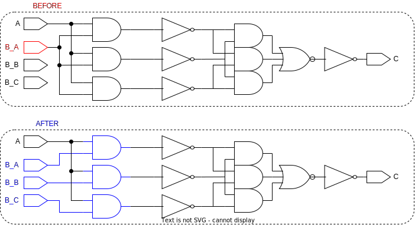

# ```rewire_input_ports```

This is a *rewire* script

## Purpose

The purpose of this script is to rewire triplicated input ports by redistribution or by voting.

## Usage

This script is called once per design right after the triplicated cells have been rewired. It is worth noting, that the output ports are handled indirectly handled by this function and ```rewire_duped_cells``` as they target the driven elements from every driving element.

When rewiring the script will check if involved nets are suffixed with "_Voted", and if so the replicants of both driving and driven connections will all be connected to one net and the net name will not be changed! These nets will be handled in a later script, ```vote_nets```.


## Definition

```tcl
proc rewire_input_ports {} {
    ###########################################################################
    # loops over every triplicated input port in order to redistribute 
    # the driven connections to its replicants, or vote in case 
    # the driven connection has not been triplicated
    #
    # input:  none
    # output: none
    ###########################################################################

    set input_ports [get_synopsys_value "all_inputs"]
    set input_ports [lsearch -all -inline [join $input_ports] "*_A"]
    
    foreach port_A $input_ports {

        # fetch corresponding pin on replicants
        set replicant_ports [get_replicants $port_A]
        set replicant_ports [lsort -increasing $replicant_ports]

        # fetch driven pins by pin on cell_A
        set driven_pins  [get_driven_pins  $port_A]
        set driven_ports [get_driven_ports $port_A]
        set driven [join [list $driven_pins $driven_ports]]

        while {[llength $driven] > 0} {

            # retrieve replicants (in the case no replicants are found the function returns the input!)
            set driven_replicants [get_replicants [lindex $driven 0]]
            set driven_replicants [lsort -increasing $driven_replicants]

            # if replicants are found, connect them to correspondingly
            if {[llength $driven_replicants] > 1} {
                if {[llength $replicant_ports] == 1} {
                    connect $replicant_ports $driven_replicants
                } elseif {[llength $driven_replicants] == 3} {
                    for {set i 0} {$i < 3} {incr i} {
                        connect [lindex $replicant_ports $i] [lindex $driven_replicants $i]
                    }
                } elseif {[llength $driven_replicants] == 9} {
                    for {set i 0} {$i < 3} {incr i} {
                        connect [lindex $replicant_ports $i] [lindex $driven_replicants $i]
                        connect [lindex $replicant_ports $i] [lindex $driven_replicants [expr $i + 3]]
                        connect [lindex $replicant_ports $i] [lindex $driven_replicants [expr $i + 6]]
                    }
                }

                set driven [lremove $driven $driven_replicants]
                continue
            }

            create_voter $replicant_ports $driven_replicants
            set driven [lremove $driven $driven_replicants]
        }
    }
}
```

This function will only work, if the following functions are sourced:

* ```get_synopsys_value```
* ```get_replicants```
* ```get_driven_pins```
* ```get_driven_ports```
* ```connect```
* ```create_voter```
* ```lremove```

## Example

The figure below is the before and after of the script. The cells outlined in red represents the targeted ports of the script. During the script the replicants are found and redistributed or voted. The redistributed nets and the rewired nets are marked with a blue outline in the "after" part of the figure.

<picture>
  <source media="(prefers-color-scheme: dark)" srcset="../figures/dark-mode/rewire_scripts/rewire_input_ports.drawio.svg">
  
</picture>

Notice that the cells are already triplicated and rewired. Cells, registers, and module instantiations are handled in a separate function ```rewire_duped_cells```.
