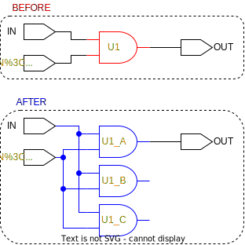

# ```triplicate_cell```

This is a *triplicate* function!

## Purpose

The purpose of this function is to have a consistent way to triplicate cells and registers.

## Usage

Anytime a cell or a register is triplicated it is done with this function. When an element is triplicated using this function all input pins on the replicant elements are rewired and driven by the same source at the original element.

## Definition

```tcl
proc triplicate_cell { cell } {
    #######################################################################################
    # triplicates a cell and connects the input of the replicants
    # to the same nets as the originals. Also renames the original
    #
    # input:  cell to be triplicated
    # output: nothing
    #######################################################################################

    # verify that it is a cell
    set cell [get_synopsys_value "get_cells -quiet $cell"]
    if {[string length $cell] < 1} {
        puts "$cell is not a cell or does not exist!"
        return
    }

    # verify that it should be triplicated
    set tmrg [get_tmrg $cell]
    if {$tmrg != true} {
        puts "tmrg attribute on cell $cell is not set to true, and the cell will not be triplicated!"
        return
    }

    # create names
    set cell_A [join [list $cell "A"] "_"]
    set cell_B [join [list $cell "B"] "_"]
    set cell_C [join [list $cell "C"] "_"]

    # create cells
    create_cell    [list $cell_A $cell_B $cell_C] $cell
    set_tmrg true  [list $cell_A $cell_B $cell_C]
    set_dont_touch [list $cell_A $cell_B $cell_C]

    # replace original cell with cell_A
    replace_cell $cell $cell_A

    # drive pins from the same as the original
    set pins [get_synopsys_value "get_pins -of_object $cell_A -filter pin_direction==in"]
    foreach pin $pins {
        set driver [get_driver_connection $pin]
        if { [llength $driver] > 0} {
            set replicant_pins [get_replicants $pin]
            connect $driver $replicant_pins
        }
    }
}
```

This function will only work, if the following functions are sourced:

* ```get_synopsys_value```
* ```replace_cell```
* ```connect```
* ```get_driver_connection```
* ```get_replicants```

## Example

An example of the function call:

```tcl
>> triplicate_cell U1
```

The names marked in orange indicate that their ```tmrg``` attribute has been set to true. The red outline marks the target, and the blue outline marks the changes that has happened.

<picture>
  <source media="(prefers-color-scheme: dark)" srcset="../figures/dark-mode/triplicate_scripts/triplicate_cell.drawio.svg">
  
</picture>
