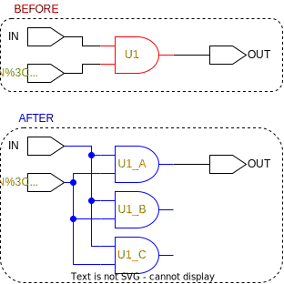

# ```triplicate_cells```

This is a *triplicate* script!

## Purpose

The purpose of this function is to triplicate all cells and registers in a design.

## Usage

After the ```tmrt``` attribute has been *updated* on all elements in a design, this script is called once to handle all registers and logic cells. This script fetches all registers and cells that should be triplicated and passes them individually as arguments to the ```triplicate_cell``` function.

## Definition

```tcl
proc triplicate_cells {} {
    ###################################################################
    # This script fetches all logic cells and registers within a design
    # with their tmrt attribute set to 'true'
    # 
    # input:  none
    # output: none
    ###################################################################
    
    # fetch all cells with the tmrt attribute = true, avoiding hierarchical instances
    set cells_to_be_triplicated [get_synopsys_value "get_cells -filter {tmrt==true && is_hierarchical==false}"]

    # fetch all registers with tmrt = true
    set registers [get_synopsys_value "all_registers -no_hierarchy"]
    foreach register $registers {
        set tmrt [get_tmrt $register]
        if {$tmrt == true} {
            set cells_to_be_triplicated [join [list $cells_to_be_triplicated $register]]
        }
    }
    
    # triplicate cells
    foreach cell $cells_to_be_triplicated {
        triplicate_cell $cell
    }
}
```

This function will only work, if the following functions are sourced:

* ```get_synopsys_value```
* ```get_tmrt```
* ```triplicate_cell```

## Example

The names marked in orange indicate that their ```tmrt``` attribute has been set to true. The red outline marks the target, and the blue outline marks the changes that has happened.

<picture>
  <source media="(prefers-color-scheme: dark)" srcset="../figures/dark-mode/triplicate_scripts/triplicate_cell.drawio.svg">
  
</picture>
