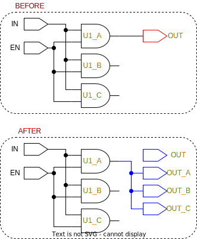

# ```triplicate_output_ports```

This is a *triplicate* script

## Purpose

The purpose of this script is to triplicate all output ports with their ```tmrt``` attribute set to true.

## Usage

After the *update* routines have run, this script is called and it triplicates the output ports using the ```triplicate_port``` function.

## Definition

```tcl
proc triplicate_output_ports {} {
    ##########################################################
    # This script retrieves all outpit ports of the current
    # design and passes them as arguments to the triplicate_port
    # function, triplicating all output ports
    #
    # input:  none
    # output: none
    ##########################################################

    # retrieve all output ports in design
    set ports [get_synopsys_value "all_outputs"]

    # look through each port, 
    # if tmrt attribute is set to "true" apply triplication rule
    foreach port $ports {
        set tmrt [get_tmrt $port]
        if {[expr $tmrt]} {
            triplicate_port $port
        }
    }
}
```

This function will only work, if the following functions are sourced:

* ```get_synopsys_value```
* ```get_tmrt```
* ```triplicate_port```

## Example

The names marked in orange indicate that their ```tmrt``` attribute has been set to true. The red outline marks the target, and the blue outline marks the changes that has happened.

<picture>
  <source media="(prefers-color-scheme: dark)" srcset="../figures/dark-mode/triplicate_scripts/triplicate_output_ports.drawio.svg">
  
</picture>
