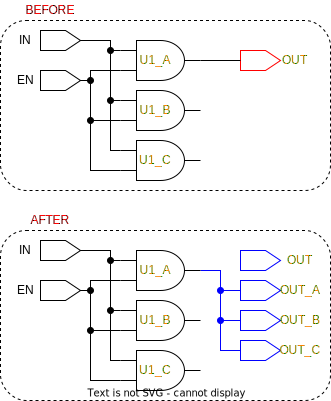

# ```triplicate_port```

This is a *triplicate* function!

## Purpose

The purpose of this function is to triplicate a single port.

## Usage

Everytime a port is triplicated, this function is called. Unlike ```triplicate_cell``` this function does not remove the original element. Renaming of ports from within a design is problematic, since there are no biult-in renaming functions. Replacing a port with an identical port of a different name is possible, however the original port should not be removed from within a design. If the ports are removed from within a design, the module instantations of the design will not recognise the correct designs.

## Definition

```tcl
proc triplicate_port { port } {
    ##################################################################################
    # triplicates a port, and renames the original port. If the port is an output, 
    # a fanout will be applied automatically
    #
    # input:  a port 
    # output: nothing
    ##################################################################################

    # verify that it is a port
    if {![is_port $port]} {
        puts "$port is not a port!"
        return
    }

    # verify that it should be triplicated
    set tmrt [get_tmrt $port]
    if {$tmrt != true} {
        puts "tmrt attribute on port $port is not set to true, and the port will not be triplicated!"
        return
    }

    # find direction, which is important when creating the ports
    set direction [get_synopsys_value "get_attribute $port pin_direction"]

    # create names
    set port_A [join [list $port "A"] "_"]
    set port_B [join [list $port "B"] "_"]
    set port_C [join [list $port "C"] "_"]

    # create ports
    create_port    [list $port_A $port_B $port_C] -direction $direction

    # add tmrt attribute
    set_tmrt true  [list $port_A $port_B $port_C]

    # # replace original port with port_A
    replace_port $port $port_A

    # connect a driving net
    if {[string equal $direction "out"]} {
        set net [get_synopsys_value "all_connected [get_ports $port_A]"]
        connect_net [get_nets $net] [get_ports $port_B]
        connect_net [get_nets $net] [get_ports $port_C]
    }
}
```

This function will only work, if the following functions are sourced:

* ```is_port```
* ```get_tmrt```
* ```get_synopsys_value```
* ```replace_port```

## Example

The figure below is an example of the following call:

```tcl
>> triplicate_port OUT
```

<picture>
  <source media="(prefers-color-scheme: dark)" srcset="../figures/dark-mode/triplicate_scripts/triplicate_output_ports.drawio.svg">
  
</picture>
