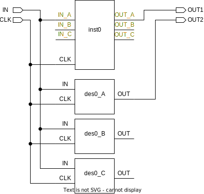

# ```get_tmrt```

This is an *update* function!

## Purpose

The purpose of this function is ensure consistency when querying for the value of the ```tmrt``` attribute. Furthermore, this function requires fewer arguments than using ```get_attribute``` (a built-in command).

## Usage

Whenever the ```tmrt``` attribute is needed, this function is called; when triplicating the return value of this function dictates whether or not triplication will occur.

## Definition

```tcl
proc get_tmrt { element } {
    ###############################################################
    # replaces the need for 'redirect -variable..'
    #
    # input:  any cell/port/pin/register
    # output: return the value of the tmrt attribute of the element,
    #         will return -1 if tmrt is not set
    ###############################################################

    # retrieve tmrt attribute
    set tmrt [get_synopsys_value "get_attribute -quiet -return_null_values $element tmrt"]

    # check if tmrt is boolean, return -1 if not
    if {[string is boolean $tmrt] && [string length $tmrt] > 0} {
        return $tmrt
    } else {
        return -1
    }
}
```

This function will only work, if the following function is sourced:

* ```get_synopsys_value```

## Example

Given the incomplete design in the figure below, calling ```get_tmrt``` on some elements will yield:

```tcl
>> get_tmrt IN
false
>> get_tmrt inst0
false
>> get_tmrt inst0/IN_A
true
>> get_tmrt des0_A
true
>> get_tmrt des0_A/IN
false
```

The text marked in orange marks triplicated elements.

<picture>
  <source media="(prefers-color-scheme: dark)" srcset="../figures/dark-mode/update_scripts/get_tmrt.drawio.svg">
  
</picture>
