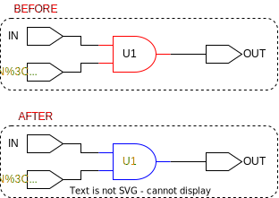

# ```set_tmrt```

This is an *update* function!

## Purpose

The purpose of this function is ensure consistency when setting the value of the ```tmrt``` attribute on cells, pins, ports, registers, and module instantiations. Furthermore, this function requires fewer arguments than using ```set_attribute``` (a built-in command).

## Usage

Whenever the ```tmrt``` attribute should be set (not updated!), this function is called.

## Definition

```tcl
proc set_tmrt { value elements } {
    ########################################################################################
    # takes a list of elements and sets their tmrt attribute (nonoverriding)
    #
    # input:  'value' that will be set as the tmrt attribute for all 'elements'
    #         will not override
    # output: nothing
    ########################################################################################

    # run through list of elements, if tmrt is already set, remove from list
    foreach element $elements {
        # check if tmrt is already set, and if so do not override
        set tmrt [get_tmrt $element]
        if {$tmrt > 0} {
            puts "tmrt is already set on $element and it will not be overridden!"
            set elements [lremove $elements $element]
        }
    }

    # set tmrt for remainding elements
    set_attribute $elements tmrt $value
}
```

This function will only work, if the following functions are sourced:

* ```get_tmrt```
* ```lremove```

## Example

In the figure below the red outline marks the target of the function, blue outline marks the affected elements, and the orange text indicates that the ```tmrt``` attributes is set to true. 

```tcl
>> set_tmrt true U1
```

<picture>
  <source media="(prefers-color-scheme: dark)" srcset="../figures/dark-mode/update_scripts/set_tmrt.drawio.svg">
  
</picture>
