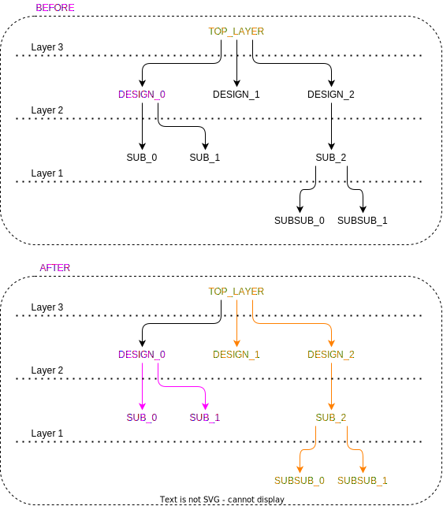

# ```update_design_default_tmrt```

This is an *update* script!

## Purpose

This script propagates the value of ```default_tmrt``` to lower layers of the hierarchy starting from the top design.

## Usage

This script is called once before any of the other *update* scripts/functions. This is due to ```default_tmrt``` being the default value for the ```tmrt``` attribute.

It is important to distinguish between module instantiations and designs. Designs are the blueprint for the module instantiations and the attributes are NOT SHARED between the two!

## Definition

```tcl
proc update_design_default_tmrt { } {
    #################################################################################
    # This function looks through the instances from the top design, and
    # assigns the appropriate default_tmrt on the DESIGNS! If contradictory 
    # default_tmrt exists, the DESIGN will be copied and treated as an
    # individual
    #
    # input:  nothing
    # output: nothing
    #################################################################################

    set top_design  [get_top_design]
    set top_default [get_synopsys_value "get_attribute -quiet $top_design default_tmrt"]
    set hierarchy   [get_hierarchy]
    set hierarchy   [lreverse $hierarchy]

    foreach level $hierarchy {
        foreach instance $level {
            # retrieve design for the instance and its associated default_tmrt
            set design       [get_synopsys_value "get_attribute -quiet $instance ref_name"]
            set default_tmrt [get_synopsys_value "get_attribute -quiet $design   default_tmrt"]

            # if default_tmrt is not set, or it was set from parent, update it (potentially creating another design)
            set default_from_parent [get_synopsys_value "get_attribute -quiet -return_null_values $design default_from_parent"]
            if { [string length $default_tmrt] < 1 || $default_from_parent == "true" } {

                # retrieve parent default_tmrt 
                set parent         [join [lrange [split $instance "/"] 0 end-1] "/"] 
                set parent_default ""
                if {[string length $parent] > 0} {  ;# if parent is found
                    set parent         [get_synopsys_value "get_attribute -quiet $parent ref_name"] 
                    set parent_default [get_synopsys_value "get_attribute -quiet $parent default_tmrt"]
                } else {                            ;# if parent is not found, use default from top design
                    set parent_default $top_default
                }

                # if default was already set from another parent (checking from another instance)
                # verify that the default_tmrt is the same, otherwise generate a new design, with the other 
                # type of default_tmrt
                if {$default_from_parent == "true"} {
                    if {$default_tmrt != $parent_default} {
                        set new_design   [join [list $design   $parent_default] "_"]
                        set new_instance [join [list $instance $parent_default] "_"]
                        copy_design $design $new_design
                        create_cell -hierarchical $new_instance $new_design
                        replace_cell $instance $new_instance "true"
                    }
                } else {
                    set_attribute $design default_tmrt        $parent_default
                    set_attribute $design default_from_parent true
                }

            }

            # set tmrt on instance if not already set
            set tmrt [get_tmrt $instance]
            if {$tmrt == -1} {
                set parent_default ""
                if {[string length $parent] > 0} {  ;# if parent is found
                    set parent         [get_synopsys_value "get_attribute -quiet $parent ref_name"] 
                    set parent_default [get_synopsys_value "get_attribute -quiet $parent default_tmrt"]
                } else {                            ;# if parent is not found, use default from top design
                    set parent_default $top_default
                }
                set_attribute $instance tmrt $parent_default
            }

        }
    }
}
```

This function will only work, if the following functions are sourced:

* ```get_top_design```
* ```get_synopsys_value```
* ```get_hierarchy```
* ```get_tmrt```
* ```get_synopsys_value```

## Example

The figure below depicts the propagation of the ```default_tmrt``` attribute through a hierarchy. Orange colour indicates that the ```default_tmrt``` attribute is set to true, whereas pink means false.

<picture>
  <source media="(prefers-color-scheme: dark)" srcset="../figures/dark-mode/update_scripts/update_design_default_tmrt.drawio.svg">
  
</picture>

Notice that the attribute is already defined for DESIGN_2, and it will not be overridden, but rather the value will propagate to designs contained in DESIGN_2
