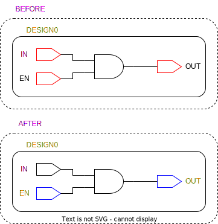

# ```update_port_tmrt```

This is an *update* script!

## Purpose

The purpose of this script is to propagate the ```default_tmrt``` attribute value to the ```tmrt``` attribute of all ports within each design.

## Usage

This function is called once after the ```default_tmrt``` attribute has been propagated to or defined on all designs.  

## Definition

```tcl
proc update_port_tmrt { top_design } {
    # loop through all designs (modules) and apply the correct tmrt for every register
    # redirect -variable designs {get_designs}
    # set designs [join $designs]
    set designs [get_synopsys_value "get_designs"]

    foreach design $designs {

        # 'jump into design' and find default
        current_design $design
        redirect -variable default_tmrt    {get_attribute $design default_tmrt}
        redirect -variable default_tmrt    {get_attribute $design default_tmrt}
        set defaul_tmrt [get_synopsys_value "get_attribute $design default_tmrt"]


        # retrieve all ports
        redirect -variable ports {get_ports}
        set ports [join $ports]

        foreach port $ports {
            # set tmrt to default, if not already set
            redirect -variable tmrt {get_attribute -quiet -return_null_values $port tmrt}
            if {[llength $tmrt] < 1} {
                set_attribute $port tmrt $default_tmrt
            }
        }
    }

    current_design $top_design
}
```

This function will only work, if the following functions is sourced:

* ```get_synopsys_value```

## Example

Below is a figure of the before and after of this script being called on a simple design. The red outlines mark the targets for the functions, the blue outlines mark the affected elements, the orange text indicates the ```default_tmrt``` or ```tmrt``` attribute is set to true (based on if it's a design or a port), and pink indicates false.

<picture>
  <source media="(prefers-color-scheme: dark)" srcset="../figures/dark-mode/update_scripts/update_port_tmrt.drawio.svg">
  
</picture>
