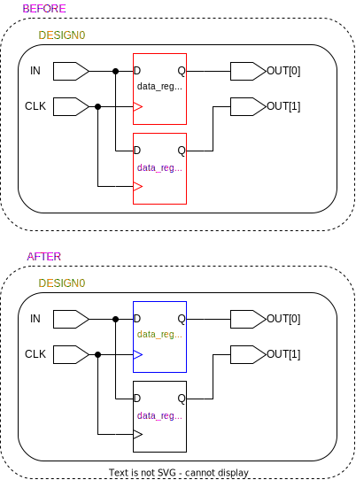

# ```update_reg_tmrt```

This is an *update* script!

## Purpose

The purpose of this script is to propagate the ```default_tmrt``` attribute value to the ```tmrt``` attribute of all registers within each design.

## Usage

This function is called once after the ```default_tmrt``` attribute has been propagated to or defined on all designs.

## Definition

```tcl
proc update_reg_tmrt { top_design } {
    # loop through all designs (modules) and apply the correct tmrt for every register
    redirect -variable designs {get_designs}
    set designs [join $designs]

    foreach design $designs {

        # 'jump into design' and find default
        current_design $design
        redirect -variable default_tmrt    {get_attribute $design default_tmrt}
        redirect -variable default_tmrt    {get_attribute $design default_tmrt}
        puts $default_tmrt

        # retrieve all registers and apply tmrt (non-overriding)
        redirect -variable registers {all_registers -no_hierarchy}
        set registers [join $registers]
        puts $registers

        # go through each register, update tmrt if not already set
        foreach register $registers {
            redirect -variable tmrt {get_attribute -quiet -return_null_values $register tmrt}
            if {[string length $tmrt] < 1} {
                set_attribute $register tmrt $default_tmrt
            }
            redirect -variable tmrt {get_attribute -quiet -return_null_values $register tmrt}
        }
    }

    # go back to top design
    current_design $top_design
}
```

## Example

Below is a figure of the before and after of this script being called on a simple design. The red outlines mark the targets for the functions, the blue outlines mark the affected elements, the orange text indicates the ```default_tmrt``` or ```tmrt``` attribute is set to true (based on if it's a design or a port), and pink indicates false.

<picture>
  <source media="(prefers-color-scheme: dark)" srcset="../figures/dark-mode/update_scripts/update_reg_tmrt.drawio.svg">
  
</picture>
