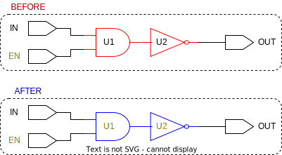

# ```update_tmrg```

This is an *update* script!

## Purpose

Attributes defined in the RTL design will only propagate to:

* Designs (modules)
* Ports
* Cells (module instantiations)
* Pins
* Inferred registers

Logic cells will not attain attributes defined in the RTL! The purpose of this function is to apply an appropriate value for the ```tmrg``` attribute on all logic cells within a design.

## Usage

This script is called once per design and only after the ports and registers have their ```tmrg``` attribute set. To/from each port, register, and module instantiation with the ```tmrg``` attribute set to true, the logic cells will also have their attribute set to true. This is done in order to mark which logic cells will be triplicated during the *triplicate* routines.

## Definition

```tcl
proc update_tmrg { top_default } {
    ##################################################################################
    # This script updates the tmrg attribute on all logic cells, by looking from/to
    # ports, registers, and module instantiaions with their tmrg attribute set to true
    # any logic cell on these paths will have their tmrg attribute updated to true
    #
    # input:  none
    # output: none
    ##################################################################################

    # define default tmrg attribute
    set design       [get_synopsys_value "current_design"]
    set default_tmrg [get_synopsys_value "get_attribute -quiet -return_null_values $design default_tmrg"]
    if {[llength $default_tmrg] < 1} {  ;# triggers if no default tmrg attribute is set
        set default_tmrg $top_default
    } 

    # retrieve all ports
    set ports_in  [get_synopsys_value "all_inputs"]
    set ports_out [get_synopsys_value "all_outputs"]

    # correct scope for input/output registers
    set registers_in  ""
    set registers_out ""

    # find all registers and their inputs and outputs, if tmrg==true use the voter's output instead
    set registers [get_synopsys_value "all_registers -no_hierarchy"]
    foreach register $registers {
        # get input pins
        set registers_in_temp  [get_synopsys_value "get_pins -quiet -of_object $register -filter pin_direction==in"]
        set registers_in       [join [list $registers_in $registers_in_temp]]

        # get output pins
        set registers_out_temp [get_synopsys_value "get_pins -quiet -of_object $register -filter pin_direction==out"]
        set registers_out      [join [list $registers_out $registers_out_temp]]
    }

    # retrieve all hierarchical cells
    set hier_cells [get_synopsys_value "get_cells -quiet -filter is_hierarchical==true"]

    # correct scope for input/output of hierarchical cells
    set hier_cells_in  ""
    set hier_cells_out ""
    
    # find all inputs and outputs of hierarchical cells and add them to the lists above
    foreach cell $hier_cells {
        set hier_cells_in_temp  [get_synopsys_value "get_pins -quiet -of_object $cell -filter pin_direction==in"]
        set hier_cells_out_temp [get_synopsys_value "get_pins -quiet -of_object $cell -filter pin_direction==out"]
        set hier_cells_in       [join [list $hier_cells_in $hier_cells_in_temp]]
        set hier_cells_out      [join [list $hier_cells_out $hier_cells_out_temp]]
    }

    set cells_to_be_triplicated ""

    # identify logic cells to be triplicated
    foreach port $ports_in {
        # skip port, if it isn't supposed to be triplicated  
        set tmrg [get_tmrg $port]   
        if {![expr $tmrg]} {
            continue
        }
        
        # target (1-to-many from input ports)
        set target [list [join [list $ports_out $registers_in $hier_cells_in]]]

        # find all cells from port to target and append them to the tbt cells
        set paths [get_synopsys_value "duplicate_logic -report_only -from $port -to $target"]
        set paths [lsort -unique $paths]
        set paths [lremove $paths [list $port $target]]
        set cells [get_synopsys_value "cell_of [list $paths]"]

        # skip cells in lower hierarchies 
        for {set i 0} {$i < [llength $cells]} {incr i} {
            set cell_hierarchy [split [lindex $cells $i]]
            set depth          [llength $cell_hierarchy]
            if {$depth > 1} {
                set cells [lremove $cells [lindex $cells $i]]
            }
        }
        lappend cells_to_be_triplicated $cells
    }

    foreach port $ports_out {
        # skip port, if it isn't supposed to be triplicated  
        set tmrg [get_tmrg $port]   
        if {![expr $tmrg]} {
            continue
        }

        # target (many-to-1 to output ports)
        set target [list [join [list $ports_in $registers_out $hier_cells_out]]]

        # find all cells from port to target and append them to the tbt cells
        set paths [get_synopsys_value "duplicate_logic -report_only -to $port -from $target"]
        set paths [lsort -unique $paths]
        set paths [lremove $paths [list $port $target]]
        set cells [get_synopsys_value "cell_of [list $paths]"]

        # skip cells in lower hierarchies 
        for {set i 0} {$i < [llength $cells]} {incr i} {
            set cell_hierarchy [split [lindex $cells $i]]
            set depth          [llength $cell_hierarchy]
            if {$depth > 1} {
                set cells [lsearch -all -inline -exact -not $cells [lindex $cells $i]]
            }
        }
        lappend cells_to_be_triplicated $cells
    }

    foreach register $registers_in {

        # set tmrg to default, if not already set
        set register_cell [get_synopsys_value "cell_of $register"]
        set tmrg          [get_tmrg $register_cell]
        if {$tmrg < 0} {
            set_tmrg $default_tmrg $register_cell
        }

        # skip register, if it isn't supposed to be triplicated
        set tmrg [get_tmrg $register_cell]  
        if {![expr $tmrg]} {
            continue
        }

        # target (many-to-1 to input of registers)
        set target [list [join [list $ports_in $registers_out $hier_cells_out]]]

        # find all cells from port to target and append them to the tbt cells
        set paths [get_synopsys_value "duplicate_logic -report_only -to $register -from $target"]
        set paths [lsort -unique $paths]
        set paths [lremove $paths [list $register $target]]
        set cells [get_synopsys_value "cell_of [list $paths]"]

        # skip cells in lower hierarchies 
        for {set i 0} {$i < [llength $cells]} {incr i} {
            set cell_hierarchy [split [lindex $cells $i]]
            set depth          [llength $cell_hierarchy]
            if {$depth > 1} {
                set cells [lsearch -all -inline -exact -not $cells [lindex $cells $i]]
            }
        }
        lappend cells_to_be_triplicated $cells
    }

    foreach register $registers_out {

        # set tmrg to default, if not already set
        set register_cell [get_synopsys_value "cell_of $register"]
        set tmrg          [get_tmrg $register_cell]
        if {$tmrg < 0} {
            set_tmrg $default_tmrg $register_cell
        }

        # skip register, if it isn't supposed to be triplicated
        set tmrg [get_tmrg $register_cell]  
        if {![expr $tmrg]} {
            continue
        }

        # target (1-to-many from register outputs)
        set target [list [join [list $ports_out $registers_in $hier_cells_in]]]

        # find all cells from port to target and append them to the tbt cells
        set paths [get_synopsys_value "duplicate_logic -report_only -from $register -to $target"]
        set paths [lsort -unique $paths]
        set paths [lremove $paths [list $register $target]]
        set cells [get_synopsys_value "cell_of [list $paths]"]

        # skip cells in lower hierarchies 
        for {set i 0} {$i < [llength $cells]} {incr i} {
            set cell_hierarchy [split [lindex $cells $i]]
            set depth          [llength $cell_hierarchy]
            if {$depth > 1} {
                set cells [lsearch -all -inline -exact -not $cells [lindex $cells $i]]
            }
        }
        lappend cells_to_be_triplicated $cells
    }

    foreach cell $hier_cells_in {
        # set tmrg to default, if not already set
        set hier_cell [get_synopsys_value "cell_of $cell"]
        set tmrg      [get_tmrg $hier_cell]
        if {$tmrg < 0} {
            set_tmrg $default_tmrg $hier_cell 
        }

        # skip cell, if it isn't supposed to be triplicated
        set tmrg [get_tmrg $hier_cell]
        if {$tmrg != true} {
            continue
        }

        # target (1-to-many from register outputs)
        set target [list [join [list $ports_in $registers_out $hier_cells_out]]]

        # find all cells from port to target and append them to the tbt cells
        set paths [get_synopsys_value "duplicate_logic -report_only -to $cell -from $target"]
        set paths [lsort -unique $paths]
        set paths [lremove $paths [list $cell $target]]
        set cells [get_synopsys_value "cell_of [list $paths]"]

        # skip cells in lower hierarchies 
        for {set i 0} {$i < [llength $cells]} {incr i} {
            set cell_hierarchy [split [lindex $cells $i]]
            set depth          [llength $cell_hierarchy]
            if {$depth > 1} {
                set cells [lsearch -all -inline -exact -not $cells [lindex $cells $i]]
            }
        }
        lappend cells_to_be_triplicated $cells
    }

    foreach cell $hier_cells_out {
        # set tmrg to default, if not already set
        set hier_cell [get_synopsys_value "cell_of $cell"]
        set tmrg      [get_tmrg $hier_cell]
        if {$tmrg < 0} {
            set_tmrg $default_tmrg $hier_cell 
        }

        # skip cell, if it isn't supposed to be triplicated
        set tmrg [get_tmrg $hier_cell]
        if {$tmrg != true} {
            continue
        }

        # target (1-to-many from register outputs)
        set target [list [join [list $ports_out $registers_in $hier_cells_in]]]

        # find all cells from port to target and append them to the tbt cells
        set paths [get_synopsys_value "duplicate_logic -report_only -to $cell -from $target"]
        set paths [lsort -unique $paths]
        set paths [lremove $paths [list $cell $target]]
        set cells [get_synopsys_value "cell_of [list $paths]"]

        # skip cells in lower hierarchies 
        for {set i 0} {$i < [llength $cells]} {incr i} {
            set cell_hierarchy [split [lindex $cells $i]]
            set depth          [llength $cell_hierarchy]
            if {$depth > 1} {
                set cells [lsearch -all -inline -exact -not $cells [lindex $cells $i]]
            }
        }
        lappend cells_to_be_triplicated $cells
    }
    
    set cells_to_be_triplicated [lsort -unique [join $cells_to_be_triplicated]]
    set_tmrg true $cells_to_be_triplicated    ;# set tmrg attribute true on each cell of a path from/to
                                               # a cell with tmrg attribute already true
}
```

## Example

Below is a figure of the before and after of this script being called on a simple design. The red outlines mark the targets for the functions, the blue outlines mark the affected elements, the orange text indicates ```tmrg``` attribute is set to true.

<picture>
  <source media="(prefers-color-scheme: dark)" srcset="../figures/dark-mode/update_scripts/update_tmrg.drawio.svg">
  
</picture>

In this case one or more of the ports could be changed for a register or module instantiation with same value on the ```tmrg``` attribute and the result would be the same
